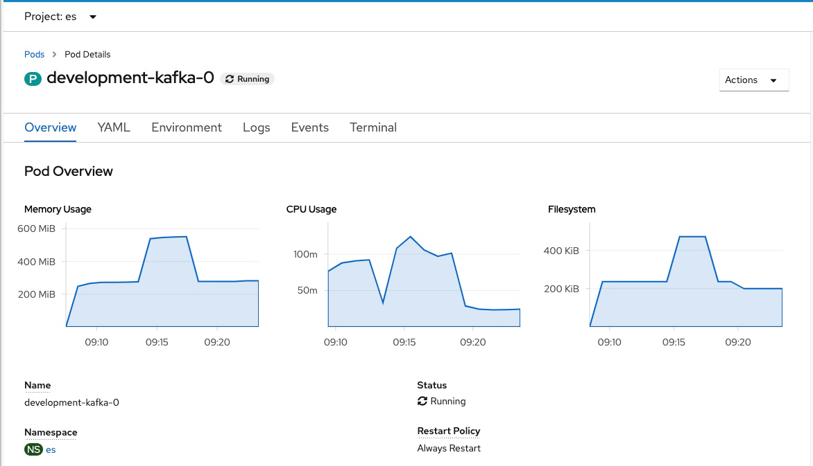

Understand the health of your {{site.data.reuse.long_name}} deployment at a glance, and learn how to find information about problems.

## Checking {{site.data.reuse.short_name}} health

### Using the {{site.data.reuse.short_name}} UI

The {{site.data.reuse.long_name}} UI provides information about the health of your environment at a glance. In the bottom right corner of the UI, a message shows a summary status of the system health. If there are no issues, the message states **System is healthy**.

If any of the {{site.data.reuse.long_name}} resources experience problems, the message states **component isn't ready**.
If any of the components are not ready for an extended period of time, see how you can troubleshoot as described in [debugging](#debugging).

### Using the {{site.data.reuse.openshift_short}} CLI

You can check the health of your {{site.data.reuse.long_name}} environment using the `oc` tool.

1. {{site.data.reuse.openshift_cli_login}}
2. To check the status and readiness of the pods, run the following command, where `<namespace>` is the space used for your {{site.data.reuse.long_name}} installation:\\
   `oc -n <namespace> get pods`\\
   The command lists the pods together with simple status information for each pod.

If any of the components are not ready for an extended period of time, check the [debugging topic](#debugging).

## Debugging

### Using the {{site.data.reuse.openshift_short}} UI

1. {{site.data.reuse.openshift_ui_login}}
2. {{site.data.reuse.task_openshift_navigate_installed_operators}}
3. {{site.data.reuse.task_openshift_select_operator}}
4. {{site.data.reuse.task_openshift_select_instance}}
5. Click on the **Resources** tab.
6. To filter only pods, deselect all resource types with the exception of **Pod**.
7. Click the pod _not_ in the **Running** state to display information regarding the pod.
8. In the **Overview**, resource usage, such as CPU and memory, can be viewed.
   {:height="100%" width="100%"}
9. Click on the **Logs** tab to search logs.

**Tip:** You can also use the [cluster logging](https://docs.openshift.com/container-platform/4.4/logging/cluster-logging.html){:target="_blank"} provided by the {{site.data.reuse.openshift_short}} to collect, store, and visualize logs. The cluster logging components are based upon Elasticsearch, Fluentd, and Kibana (EFK). You can download and install the pre-configured {{site.data.reuse.short_name}} Kibana dashboards by following the instructions in [monitoring cluster health](../cluster-health/).

### Using the {{site.data.reuse.openshift_short}} CLI

1. To retrieve further details about the pods, including events affecting them, use the following command:\\
   `oc -n <namespace> describe pod <pod-name>`
2. To retrieve detailed log data for a pod to help analyze problems, use the following command:\\
   `oc -n <namespace> logs <pod-name> -c <container_name>`

For more information about debugging, see the [Kubernetes documentation](https://kubernetes.io/docs/tasks/debug-application-cluster/debug-application-introspection/#using-kubectl-describe-pod-to-fetch-details-about-pod){:target=”\_blank”}. You can use the [`oc` command](https://docs.openshift.com/container-platform/4.4/cli_reference/openshift_cli/usage-oc-kubectl.html){:target=“\_blank”} instead of `kubectl` to perform the debugging steps.

**Note:** After a component restarts, the `oc` command retrieves the logs for the new instance of the container. To retrieve the logs for a previous instance of the container, add the `-–previous` option to the `oc logs` command.
