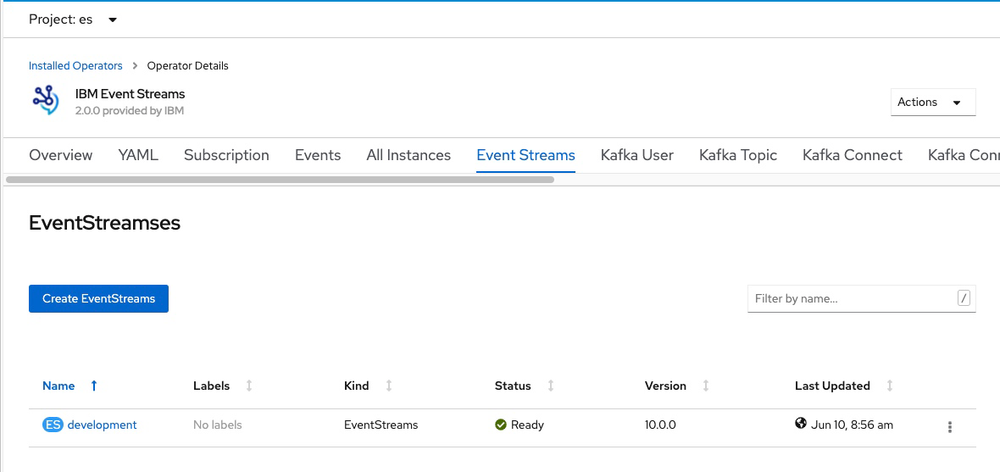

Upgrade your installation of {{site.data.reuse.long_name}} operator to 2.2.0 and operand to 10.2.0-eus as follows.

## Upgrade paths

The following upgrade paths are available:
- You can upgrade the {{site.data.reuse.short_name}} operator to version 2.2.0 directly from versions 2.0.0, 2.0.1 and 2.1.0.
- You can upgrade the {{site.data.reuse.short_name}} operand to version 10.2.0-eus directly from version 10.0.0 and 10.1.0.
- If you have an earlier version than 10.0.0, you must first upgrade your {{site.data.reuse.short_name}} version [to 10.0.0](../../10.0/installing/upgrading/), before upgrading to 10.2.0.

## Prerequisites

If you are upgrading {{site.data.reuse.short_name}} in an existing {{site.data.reuse.cp4i}} deployment, ensure that the {{site.data.reuse.cp4i}} operator has been upgraded from 2020.3.1 to [v2020.4.1](https://www.ibm.com/support/knowledgecenter/SSGT7J_20.4/upgrade/upgrade.html){:target="_blank"}. This adds the  {{site.data.reuse.long_name}} operator version 2.2.0 to the {{site.data.reuse.openshift_short}} OperatorHub catalog.

To upgrade successfully, your {{site.data.reuse.short_name}} instance must have more than one ZooKeeper node or have persistent storage enabled. If you upgrade an {{site.data.reuse.short_name}} instance with a single ZooKeeper node that has ephemeral storage, all messages and all topics will be lost and both ZooKeeper and Kafka pods will move to an error state. To avoid this issue, increase the number of ZooKeeper nodes before upgrading as follows:

```
apiVersion: eventstreams.ibm.com/v1beta1
kind: EventStreams
metadata:
  name: example-pre-upgrade
  namespace: myproject
spec:
  strimziOverrides:
    zookeeper:
      replicas: 3
```

## Upgrade process

The upgrade process requires the upgrade of the {{site.data.reuse.short_name}} operator, and then the upgrade of your {{site.data.reuse.short_name}} instances. Complete the steps in the following sections to upgrade your {{site.data.reuse.short_name}} installation.

### Upgrade the {{site.data.reuse.short_name}} operator to 2.2.0

1. {{site.data.reuse.openshift_ui_login}}
2. Expand **Operators** in the navigation on the left, and click **Installed Operators**.\\
   {:height="50%" width="50%"}
3. Locate the operator that manages your {{site.data.reuse.short_name}} instance in the namespace. It is called **{{site.data.reuse.long_name}}** in the **NAME** column.
4. Click the **{{site.data.reuse.long_name}}** link in the row and click the **Subscription** tab. This shows the **Subscription Overview** for the **{{site.data.reuse.short_name}}** operator.
5. Select **v2.1** in the **Channel** section. The **Change Subscription Update Channel** dialog is displayed, showing the channels that are available to upgrade to.
6. Select **2.2-eus** and click the **Save** button on the **Change Subscription Update Channel** dialog.

All {{site.data.reuse.short_name}} pods that need to be updated as part of the upgrade will be gracefully rolled. Where required ZooKeeper pods will roll one at a time, followed by Kafka brokers rolling one at a time.

**Note:** The number of containers in each Kafka broker will reduce from 2 to 1 as the TLS-sidecar container will be removed from each broker during the upgrade process.

### Upgrade the {{site.data.reuse.short_name}} operand (instance) to 10.2.0-eus

1. Click **Installed Operators** from the navigation on the left to show the list of installed operators that includes the upgraded **{{site.data.reuse.long_name}}** operator.
2. Select the **{{site.data.reuse.long_name}}** operator from the list of **Installed Operators**.
3. Select the **{{site.data.reuse.short_name}}** tab. This lists the **{{site.data.reuse.short_name}}** operands.
4. Find your instance in the **Name** column and click the link for the instance. \\
   {:height="100%" width="100%"}
5. Select the **YAML** tab. The **{{site.data.reuse.short_name}}** instance custom resource is shown.
6. In the YAML, change the version field from 10.1.0 to 10.2.0-eus.
7. Click the **Save** button.

All {{site.data.reuse.short_name}} pods will gracefully roll again.

### Verify the upgrade

1. Wait for all {{site.data.reuse.short_name}} pods to complete the upgrade process. This is indicated by the `Running` state.
2. {{site.data.reuse.openshift_cli_login}}
3. To retrieve a list of {{site.data.reuse.short_name}} instances, run the following command:\\
   `oc get es -n <namespace>`
4. For the instance of {{site.data.reuse.short_name}} that you upgraded, check that the status returned by the command in the previous step is `Ready`.

## Post-upgrade tasks

### Delete the 'eventstreams-cluster-operator' operand request

{{site.data.reuse.short_name}} uses operand request resources to declare the required {{site.data.reuse.icpcs}} components. In {{site.data.reuse.short_name}} version 10.2.0 and later, operand request resources are only created for individual instances of {{site.data.reuse.short_name}}. In versions 10.0.0 and 10.1.0, the operator also had an operand request created when installed. After upgrading to version 10.2.0 or later, you can delete the previous operand request for the earlier operator version as follows:

```
oc delete operandrequest -n <operator_namespace> eventstreams-cluster-operator
```

where `<operator_namespace>` is either the specific namespace where the operator was [deployed](../installing/#install-the-event-streams-operator) to manage instances of {{site.data.reuse.short_name}} in that namespace only, or it is `openshift-operators` if the operator was [deployed](../installing/#install-the-event-streams-operator) to manage instances of {{site.data.reuse.short_name}} in any namespace..

### Upgrade the Kafka broker protocol version

When upgrading from 10.0.0, ensure you change the `inter.broker.protocol.version` value in the YAML and set it to `2.6` after all previous steps are complete and the cluster’s behavior and performance have been verified.

### Upgrade to use the Apicurio Registry

If you want to migrate from the deprecated {{site.data.reuse.short_name}} schema registry to Apicurio Registry, you will need to move your schemas to the new registry and reconfigure any applications that use those schemas to connect to the new registry, as described in [migrating](../migrating-to-apicurio/).
