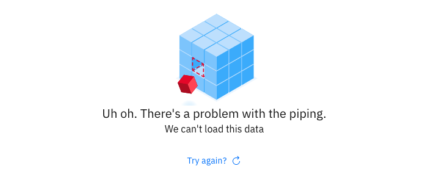

## Symptoms

When using the {{site.data.reuse.long_name}} UI, the **Monitor** and the **Topics > Producers** tabs do not load, displaying the following message:

## Causes

The {{site.data.reuse.cp4i}} monitoring service might not be installed. In general, the monitoring service is installed by default during the  {{site.data.reuse.cp4i}} installation. However, some deployment methods do not install the service.

## Resolving the problem

Install the {{site.data.reuse.cp4i}} monitoring service from the [Catalog or CLI](https://www.ibm.com/support/knowledgecenter/en/SSGT7J_21.1/monitoring/1.7.0/monitoring_service.html#install_monitsrv){:target="_blank"}.
