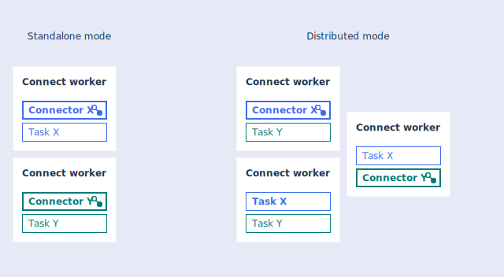

You can integrate external systems with {{site.data.reuse.long_name}} by using the Kafka Connect framework and connectors.

## What is Kafka Connect?

When connecting Apache Kafka and other systems, the technology of choice is the [Kafka Connect framework](https://kafka.apache.org/documentation/#connect){:target="_blank"}.

Use Kafka Connect to reliably move large amounts of data between your Kafka cluster and external systems. For example, it can ingest data from sources such as databases and make the data available for stream processing.

## Source and sink connectors

Kafka Connect uses connectors for moving data into and out of Kafka. **Source connectors** import data from external systems into Kafka topics, and **sink connectors** export data from Kafka topics into external systems. A wide range of connectors exists, some of which are commercially supported. In addition, you can write your own connectors.

A number of source and sink connectors are available to use with {{site.data.reuse.short_name}}. See the [connector catalog](#connector-catalog) section for more information.

## Workers

Kafka Connect connectors run inside a Java process called a worker. Kafka Connect can run in either standalone or distributed mode. Standalone mode is intended for testing and temporary connections between systems, and all work is performed in a single process. Distributed mode is more appropriate for production use, as it benefits from additional features such as automatic balancing of work, dynamic scaling up or down, and fault tolerance.

When you run Kafka Connect with a standalone worker, there are two configuration files:
* The worker configuration file contains the properties needed to connect to Kafka. This is where you provide the details for connecting to Kafka.
* The connector configuration file contains the properties needed for the connector. This is where you provide the details for connecting to the external system (for example, IBM MQ).

When you run Kafka Connect with the distributed worker, you still use a worker configuration file but the connector configuration is supplied using a REST API. Refer to the Kafka Connect documentation for more details about the distributed worker.

For getting started and problem diagnosis, the simplest setup is to run only one connector in each standalone worker. Kafka Connect workers print a lot of information and it's easier to understand if the messages from multiple connectors are not interleaved.

## Connector catalog

The connector catalog contains a list of connectors that have been verified with {{site.data.reuse.short_name}}.

Connectors are either supported by the community or IBM. Community support means the connectors are supported through the community by the people that created them. IBM supported connectors are fully supported as part of the official {{site.data.reuse.short_name}} support entitlement if you are using the paid-for version of {{site.data.reuse.short_name}} (not {{site.data.reuse.ce_short}}).

See the [connector catalog](../../connectors/){:target="_blank"} for a list of connectors that work with {{site.data.reuse.short_name}}.

## Setting up connectors

{{site.data.reuse.short_name}} provides help with setting up your Kafka Connect environment, adding connectors to that environment, and starting the connectors. See the instructions about [setting up and running connectors](../setting-up-connectors/).

## Connectors for IBM MQ

Connectors are available for copying data between IBM MQ and {{site.data.reuse.short_name}}. There is a {{site.data.reuse.kafka-connect-mq-source-short}} for copying data from IBM MQ into {{site.data.reuse.short_name}} or Apache Kafka, and a {{site.data.reuse.kafka-connect-mq-sink-short}} for copying data from {{site.data.reuse.short_name}} or Apache Kafka into IBM MQ.

For more information about MQ connectors, see the topic about [connecting to IBM MQ](../mq/).
