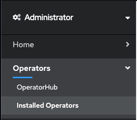
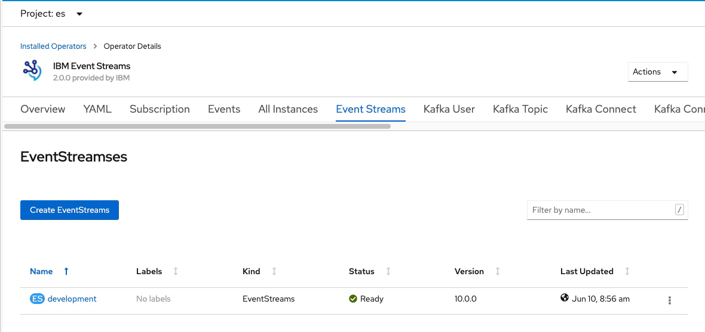
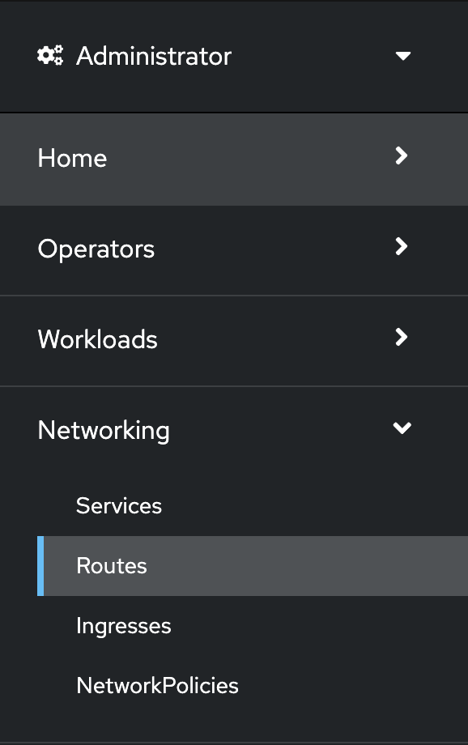
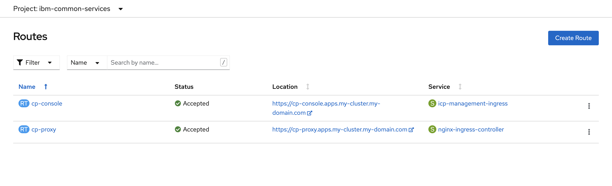

When external access is configured, {{site.data.reuse.short_name}} uses OpenShift routes for access to its UI and CLI. Find out how to retrieve the URLs for your {{site.data.reuse.short_name}} UI and CLI. You can then use the appropriate URL to log in to your {{site.data.reuse.short_name}} instance.

Log in to {{site.data.reuse.short_name}} UI and CLI as follows:

1. Retrieve the URL of your instance.
2. Use the URL to log in to your instance.

## Logging in to {{site.data.reuse.short_name}} UI

You can retrieve the URL for accessing the {{site.data.reuse.short_name}} UI:

- By using the {{site.data.reuse.openshift_short}} web console.
- By using the OpenShift command-line tool (`oc`).

### Using the {{site.data.reuse.openshift_short}} web console

Use the OpenShift web console to retrieve the URL for your {{site.data.reuse.short_name}} UI as follows:

1. {{site.data.reuse.openshift_ui_login}}
2. Expand **Operators** in the navigation on the left, and click **Installed Operators**.

   {:height="50%" width="50%"}
3. Locate the operator that manages your {{site.data.reuse.short_name}} instance in the namespace. It is called **{{site.data.reuse.long_name}}** in the **NAME** column.
4. Click the **{{site.data.reuse.long_name}}** link in the row and click the **{{site.data.reuse.short_name}}** tab. This lists the **{{site.data.reuse.short_name}}** instances related to this operator.
5. Find your instance in the **Name** column and click the link for the instance.

   {:height="100%" width="100%"}
6. A link to the {{site.data.reuse.long_name}} UI is displayed under the label **Admin UI**. Click the link to open the {{site.data.reuse.long_name}} UI login page in your browser tab.
7. Log in to your {{site.data.reuse.long_name}} UI from a supported [web browser](../../installing/prerequisites/#ibm-event-streams-ui). Use your credentials provided to you by your cluster administrator.
   A cluster administrator can manage access rights by following the instructions in [managing access](../../security/managing-access/#accessing-the-event-streams-ui-and-cli).
   Enter your username and password to access the {{site.data.reuse.short_name}} UI.

### Using the OpenShift command-line tool (`oc`)

To retrieve the URL for your {{site.data.reuse.short_name}} UI, use the following commands:

1. {{site.data.reuse.openshift_cli_login}}
2. Find the URL of your services as follows.

   ```shell
   oc get routes -n <namespace> -l app.kubernetes.io/name=admin-ui
   ```

   The following is an example output, and you use the value from the **HOST/PORT** column to log in to your UI in a web browser:
   
   ```shell
   NAME                        HOST/PORT                                                           PATH   SERVICES                    PORT   TERMINATION   WILDCARD
   my-eventstreams-ibm-es-ui   my-eventstreams-ibm-es-ui-myproject.apps.my-cluster.my-domain.com          my-eventstreams-ibm-es-ui   3000   reencrypt     None
   ```
3. Enter the address in a web browser. Add `https://` in front of the **HOST/PORT** value. For example:
   ```shell
   https://my-eventstreams-ibm-es-ui-myproject.apps.my-cluster.my-domain.com
   ```
4. Log in to your {{site.data.reuse.long_name}} UI from a supported [web browser](../../installing/prerequisites/#ibm-event-streams-ui). Use your credentials provided to you by your cluster administrator. A cluster administrator can manage access rights by following the instructions in [managing access](../../security/managing-access/#accessing-the-event-streams-ui-and-cli). Enter your username and password to access the {{site.data.reuse.short_name}} UI.

## Logging in to {{site.data.reuse.short_name}} CLI

You can retrieve the URL for accessing the {{site.data.reuse.short_name}} CLI:

- By using the {{site.data.reuse.openshift_short}} web console.
- By using the OpenShift command-line tool (`oc`).

### Using the {{site.data.reuse.openshift_short}} web console

Use the OpenShift web console to retrieve the URL for your {{site.data.reuse.short_name}} CLI as follows:

1. {{site.data.reuse.openshift_ui_login}}
2. Expand **Networking** in the navigation on the left, and select **Routes**.

   {:height="50%" width="50%"}
3. Expand the **Project** at the top of the page and select **ibm-common-services**.

   The following is an example output, and you use the value from the **Location** column for the **cp-console** entry to log in to your CLI in a terminal window:

   
4. Enter the address on your login command in a terminal. For example:
   ```shell
   cloudctl login -a https://cp-console.apps.my-cluster.my-domain.com
   ```
5. Use your credentials provided to you by your cluster administrator.
   A cluster administrator can manage access rights by following the instructions in [managing access](../../security/managing-access/#accessing-the-event-streams-ui-and-cli).
   Enter your username and password to access the {{site.data.reuse.short_name}} CLI.
6. Initialize the {{site.data.reuse.short_name}} plugin by running the following command:
   ```shell
   cloudctl es init -n <namespace>
   ```

### Using the OpenShift command-line tool (`oc`)

The process for initializing the {{site.data.reuse.short_name}} CLI is different depending on the [configured authentication type](../../installing/configuring/#configuring-ui-and-cli-security):

- {{site.data.reuse.icpfs}} Identity and Access Management (IAM)
- Salted Challenge Response Authentication Mechanism (SCRAM)

#### Authentication type set to IAM

When you have the authentication type set to IAM, retrieve the login URL for the {{site.data.reuse.short_name}} CLI, then log in and initialize the CLI as follows:

1. {{site.data.reuse.openshift_cli_login}}
2. Run the following command:

   ```shell
   oc get routes -n ibm-common-services -l app.kubernetes.io/name=management-ingress
   ```

   The following is an example output, and you use the value from the **HOST/PORT** column for the **cp-console** entry to log in to your CLI in a terminal:

   ```shell
   NAME         HOST/PORT                                  PATH   SERVICES                   PORT    TERMINATION            WILDCARD
   cp-console   cp-console.apps.my-cluster.my-domain.com          icp-management-ingress     https   reencrypt/Redirect     None
   cp-proxy     cp-proxy.apps.my-cluster.my-domain.com            nginx-ingress-controller   https   passthrough/Redirect   None
   ```
3. Enter the address on your login command in a terminal. Add `https://` in front of the **HOST/PORT** value. For example:
   ```shell
   cloudctl login -a https://cp-console.apps.my-cluster.my-domain.com
   ```
4. Use your credentials provided to you by your cluster administrator.
   A cluster administrator can manage access rights by following the instructions in [managing access](../../security/managing-access/#accessing-the-event-streams-ui-and-cli).
   Enter your username and password to access the {{site.data.reuse.short_name}} CLI.
5. Initialize the {{site.data.reuse.short_name}} plugin by running the following command:
   ```shell
   cloudctl es init -n <namespace>
   ```

#### Authentication type set to SCRAM

When you have the authentication type set to SCRAM, obtain the required credentials and endpoints, and then intialize and log in to the {{site.data.reuse.short_name}} CLI as follows:

1. Obtain the following credentials and endpoints from your cluster administrator:
   - Username
   - Password
   - Admin API URL
   - Schema registry URL

   A cluster administrator can retrieve credentials and manage access rights by following the instructions in [managing access](../../security/managing-access/#managing-access-to-kafka-resources).

2. Using the credentials and information you obtained earlier, initialize the {{site.data.reuse.short_name}} plugin by running the following command:

   ```shell
   cloudctl es init --auth-type scram-sha-512
   ```

   **Note:** For the {{site.data.reuse.short_name}} CLI plugin to be set up, ensure you add `auth-type` as `scram-sha-512`. If `auth-type` is not present, the cluster will set up IAM as the authentication type by default. For more information, see [configuring UI and CLI security](../../installing/configuring/#configuring-ui-and-cli-security).

3. Enter the credentials and endpoints when prompted to log in to the {{site.data.reuse.short_name}} CLI.

   Alternatively, instead of waiting for the prompt, you can also run the command with all the credentials and endpoints as additional arguments in one command as follows:

   ```shell
   cloudctl es init --auth-type scram-sha-512 --username <USERNAME> --password <PASSWORD> --api-url <ADMIN_API_URL> --schema-reg-url <SCHEMA_REGISTRY_URL>
   ```

## Logging out

Logging out of {{site.data.reuse.short_name}} does not log you out of your session entirely. To log out, you must first log out of your {{site.data.reuse.icpfs}} session, and then log out of your {{site.data.reuse.short_name}} session.

To log out of {{site.data.reuse.short_name}}:

1. {{site.data.reuse.icpfs_ui_login}}
2. Click the user icon in the upper-right corner of the window, and click **Log out**.
3. Return to your {{site.data.reuse.short_name}} UI and click the user icon in the upper-right corner of the window, and click **Log out**.
