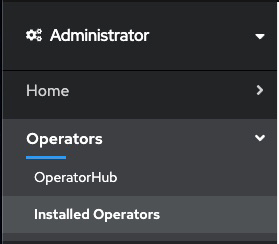

Upgrade your {{site.data.reuse.long_name}} installation as follows. The {{site.data.reuse.short_name}} operator handles the upgrade of your {{site.data.reuse.short_name}} instance.


**Note:** There is no downtime during the {{site.data.reuse.short_name}} upgrade. The Kafka pods are rolled one at a time, so a Kafka instance will always be present to serve traffic. However, if the number of brokers you have matches the `min.insync.replicas` value set for any of your topics, then that topic will be unavailable to write to while the Kafka pods are rolling.

## Upgrade paths

Understand the upgrade paths available for Continuous Delivery (CD) releases and Extended Update Support (EUS) releases.

### Upgrade paths for CD releases

You can upgrade {{site.data.reuse.short_name}} to the latest 11.2.x version directly from any 11.1.x or 11.0.x version by using operator version 3.2.0. If you have an earlier {{site.data.reuse.short_name}} version than 11.0.x, you must first upgrade it to [version 11.0.x](../../11.0/installing/upgrading/) before upgrading to 11.2.x.

**Note:** If your operator upgrades are set to automatic, minor version upgrades are completed automatically. This means that the {{site.data.reuse.short_name}} operator is upgraded to 3.2.0 when it is available in the catalog, and your {{site.data.reuse.short_name}} instance is then also automatically upgraded, unless you [set a schedule for the upgrade](#scheduling-the-upgrade-of-an-instance) by pausing the reconciliation.

### Upgrade paths for EUS releases

No direct upgrade from EUS to the latest version is supported. Upgrade to [CD version 11.0.x](../../11.0/installing/upgrading/) and then proceed to upgrade your {{site.data.reuse.short_name}} version to the latest by following the instructions on this page starting with the [prerequisites](#prerequisites) (operator version 3.2.0).

## Prerequisites

- If you are running on the {{site.data.reuse.openshift_short}}, ensure you have followed the [upgrade steps for {{site.data.reuse.cp4i}}](https://www.ibm.com/docs/en/cloud-paks/cp-integration/2022.2?topic=upgrading){:target="_blank"} before upgrading {{site.data.reuse.short_name}}.

- If you are running on other Kubernetes platforms, ensure you have added the [IBM helm repository](../installing-on-kubernetes/#add-the-helm-repository) before upgrading {{site.data.reuse.short_name}}.

- The images for {{site.data.reuse.short_name}} release 11.2.x are available in the IBM Cloud Container Registry. Ensure you redirect your catalog source to use `icr.io/cpopen` as described in [Implementing ImageContentSourcePolicy to redirect to the IBM Container Registry](https://www.ibm.com/docs/en/cloud-paks/1.0?topic=clusters-migrating-from-docker-container-registry#implementing-imagecontentsourcepolicy-to-redirect-to-the-ibm-container-registry){:target="_blank"}.


- To upgrade successfully, your {{site.data.reuse.short_name}} instance must have more than one ZooKeeper node or have persistent storage enabled. If you upgrade an {{site.data.reuse.short_name}} instance with a single ZooKeeper node that has ephemeral storage, all messages and all topics will be lost and both ZooKeeper and Kafka pods will move to an error state. To avoid this issue, increase the number of ZooKeeper nodes before upgrading as follows:


   ```yaml
   apiVersion: eventstreams.ibm.com/v1beta2
   kind: EventStreams
   metadata:
     name: example-pre-upgrade
     namespace: myproject
   spec:
     strimziOverrides:
       zookeeper:
         replicas: 3
   ```

- If you [installed the {{site.data.reuse.short_name}} operator]({{ 'installpagedivert' | relative_url }}) to manage instances of {{site.data.reuse.short_name}} in any namespace (one per namespace), then you might need to control when each of these instances is upgraded to the latest version. You can control the updates by pausing the reconciliation of the instance configuration as described in the following sections.

### Scheduling the upgrade of an instance

In 11.1.x and later, the {{site.data.reuse.short_name}} operator handles the upgrade of your {{site.data.reuse.short_name}} instance automatically after the operator is upgraded. No additional step is required to change the instance (product) version.

If your operator manages more than one instance of {{site.data.reuse.short_name}}, you can control when each instance is upgraded by pausing the reconciliation of the configuration settings for each instance, running the upgrade, and then unpausing the reconciliation when ready to proceed with the upgrade for a selected instance.


#### Pausing reconciliation by using the CLI

  1. {{site.data.reuse.cncf_cli_login}}
  2. To apply the annotation first to the `EventStreams` and then to the `Kafka` custom resource, run the following command, where `<type>` is either `EventStreams` or `Kafka`:

     `kubectl annotate <type> <instance-name> -n <instance-namespace> eventstreams.ibm.com/pause-reconciliation='true'`

  3. Follow the steps to upgrade by using [the Kuberenetes CLI](#upgrading-by-using-the-cli) or [the OpenShift web console](#upgrading-by-using-the-openshift-web-console).

#### Unpausing reconciliation by using the CLI
  To unpause the reconciliation and continue with the upgrade of an {{site.data.reuse.short_name}} instance, run the following command to first remove the annotations from the `Kafka` custom resource, and then from the `EventStreams` custom resource, where `<type>` is either `Kafka` or `EventStreams`:

   `kubectl annotate <type> <instance-name> -n <instance-namespace> eventstreams.ibm.com/pause-reconciliation-`

   When the annotations are removed, the configuration of your instance is updated, and the upgrade to the latest version of {{site.data.reuse.short_name}} completes.

#### Pausing reconciliation by using the OpenShift web console

   1. {{site.data.reuse.openshift_ui_login}}
   2. Expand **Operators** in the navigation on the left, and click **Installed Operators**.

      {:height="50%" width="50%"}

   3. From the **Project** list, select the namespace (project) the instance is installed in.
   4. Locate the operator that manages your {{site.data.reuse.short_name}} instance in the namespace. It is called **{{site.data.reuse.long_name}}** in the **Name** column. Click the **{{site.data.reuse.long_name}}** link in the row.
   5. Select the instance you want to pause and click the `YAML` tab.
   6. In the `YAML` for the custom resource, add `eventstreams.ibm.com/pause-reconciliation: 'true'` to the `metadata.annotations` field as follows:

       ```yaml
       apiVersion: eventstreams.ibm.com/v1beta2
       kind: EventStreams
       metadata:
         name: <instance-name>
         namespace: <instance-namespace>
         annotations:
           eventstreams.ibm.com/pause-reconciliation: 'true'
       ```

   7. This annotation also needs to be applied to the corresponding `Kafka` custom resource. Expand **Home** in the navigation on the left,  click **API Explorer**, and type `Kafka` in the `Filter by kind...` field. Select `Kafka`.
   8. From the **Project** list, select the namespace (project) the instance is installed in and click the **Instances** tab.
   9. Select the instance with the name `<instance-name>` (the same as the {{site.data.reuse.long_name}} instance).
   10. In the `YAML` for the custom resource, add `eventstreams.ibm.com/pause-reconciliation: 'true'` to the `metadata.annotations` field as follows:

       ```yaml
       apiVersion: eventstreams.ibm.com/v1beta2
       kind: Kafka
       metadata:
         name: <instance-name>
         namespace: <instance-namespace>
         annotations:
           eventstreams.ibm.com/pause-reconciliation: 'true'
       ```
   11. Follow the steps to upgrade by using [the Kuberenetes CLI](#upgrading-by-using-the-cli) or [the OpenShift web console](#upgrading-by-using-the-openshift-web-console).

#### Unpausing reconciliation by using the OpenShift web console
   To unpause the reconciliation and continue with the upgrade of an {{site.data.reuse.short_name}} instance, first remove the annotations from the `Kafka` custom resource, and then from the `EventStreams` custom resource. When the annotations are removed, the configuration of your instance is updated, and the upgrade to the latest version of {{site.data.reuse.short_name}} completes.

## Upgrading on the {{site.data.reuse.openshift_short}}

Upgrade your {{site.data.reuse.short_name}} instance running on the {{site.data.reuse.openshift_short}} by using the CLI or web console as follows.

### Upgrading by using the CLI

If you are using the OpenShift command-line interface (CLI), the `oc` command, complete the steps in the following sections to upgrade your {{site.data.reuse.short_name}} installation.

1. {{site.data.reuse.openshift_cli_login}}
2. Ensure the required {{site.data.reuse.long_name}} Operator Upgrade Channel is available:

   `oc get packagemanifest ibm-eventstreams -o=jsonpath='{.status.channels[*].name}'`

2. Change the subscription to move to the required update channel, where `vX.Y` is the required update channel (for example, `v3.0`):

   `oc patch subscription -n <namespace> ibm-eventstreams --patch '{"spec":{"channel":"vX.Y"}}' --type=merge`

   **Important:** You might receive a warning message similar to the following in the status:
   ```
   Invalid value '11.0.4' set for spec.version. Your instance will be reconciled as 'latest', the only valid value for spec.version. Ensure you set spec.version to 'latest'.
   ```
   To remove the warning, change the `spec.version` to `latest` by entering the following command:

   `oc patch eventstreams -n <namespace> <name-of-the-es-instance> --patch '{"spec":{"version":"latest"}}' --type=merge`


All {{site.data.reuse.short_name}} pods that need to be updated as part of the upgrade will be gracefully rolled. Where required, ZooKeeper pods will roll one at a time, followed by Kafka brokers rolling one at a time.

### Upgrading by using the OpenShift web console

If you are using the {{site.data.reuse.openshift_short_name}} web console, complete the steps in the following sections to upgrade your {{site.data.reuse.short_name}} installation.

1. {{site.data.reuse.openshift_ui_login}}
2. Expand **Operators** in the navigation on the left, and click **Installed Operators**.

   {:height="50%" width="50%"}
3. From the **Project** list, select the namespace (project) the instance is installed in.
4. Locate the operator that manages your {{site.data.reuse.short_name}} instance in the namespace. It is called **{{site.data.reuse.long_name}}** in the **Name** column. Click the **{{site.data.reuse.long_name}}** link in the row.
4. Click the **Subscription** tab to display the **Subscription details** for the {{site.data.reuse.short_name}} operator.
5. Click the version number link in the **Update channel** section (for example, **v3.0**). The **Change Subscription update channel** dialog is displayed, showing the channels that are available to upgrade to.
6. Select **v3.1** and click the **Save** button on the **Change Subscription Update Channel** dialog.

   **Important:** If you receive a warning message similar to the following in the status, remove it by changing the value of the `spec.version` field to `latest` in the YAML file:

   ```
   Invalid value '11.1.0' for spec.version. The only valid value is 'latest'. Edit spec.version to set the field to 'latest'.
   ```
All {{site.data.reuse.short_name}} pods that need to be updated as part of the upgrade will be gracefully rolled. Where required, ZooKeeper pods will roll one at a time, followed by Kafka brokers rolling one at a time.

**Note:** The number of containers in each Kafka broker will reduce from 2 to 1 as the TLS-sidecar container will be removed from each broker during the upgrade process.

<!--- Alternative steps for PlatformUI to be added. Sounds like CP4I don’t support our latest setting in this release, but might do in the next (or later).-->

## Upgrading on other Kubernetes platforms

If you are running {{site.data.reuse.short_name}} on Kubernetes platforms that support the Red Hat Universal Base Images (UBI) containers, you can upgrade {{site.data.reuse.short_name}} by using the Helm chart.

To upgrade {{site.data.reuse.short_name}} to the latest version, run the following command:
  ```
  helm upgrade \
  <release-name> ibm-helm/ibm-eventstreams-operator \
  -n <namespace> \
  --set watchAnyNamespace=<true/false>
  ```
Where:
- `<release-name>` is the name you provide to identify your operator.
- `<namespace>` is the name of the namespace where you want to install the operator.
- `watchAnyNamespace=<true/false>` determines whether the operator manages instances of {{site.data.reuse.short_name}} in any namespace or only a single namespace (default is `false` if not specified). For more information, see [choosing operator installation mode](../installing-on-kubernetes/#choosing-operator-installation-mode).


## Verifying the upgrade

1. Wait for all {{site.data.reuse.short_name}} pods to reconcile. This is indicated by the `Running` state.
2. {{site.data.reuse.cncf_cli_login}}
3. To retrieve a list of {{site.data.reuse.short_name}} instances, run the following command:

   `kubectl get eventstreams -n <namespace>`

4. For the instance of {{site.data.reuse.short_name}} that you upgraded, check that the status returned by the following command is `Ready`.

   `kubectl get eventstreams -n <namespace> <name-of-the-es-instance> -o jsonpath="{.status.phase}"`

5. To check the version of your {{site.data.reuse.short_name}} instance, run the following command:

   `kubectl get eventstreams -n <namespace> <name-of-the-es-instance> -o jsonpath="{.status.versions.reconciled}"`

## Post-upgrade tasks

### Enable collection of producer metrics

In {{site.data.reuse.short_name}} version 11.0.0 and later, a Kafka Proxy handles gathering metrics from producing applications. The information is displayed in the [**Producers** dashboard](../../administering/topic-health/). The proxy is optional and is not enabled by default. To enable metrics gathering and have the information displayed in the dashboard, [enable the Kafka Proxy](../../installing/configuring/#enabling-collection-of-producer-metrics).

### Enable metrics for monitoring

To display metrics in the monitoring dashboards of the {{site.data.reuse.short_name}} UI:

- If you are running {{site.data.reuse.short_name}} on the {{site.data.reuse.openshift_short}}, ensure you [enable](https://www.ibm.com/docs/en/cloud-paks/cp-integration/2022.4?topic=administering-enabling-openshift-container-platform-monitoring){:target="_blank"} the monitoring stack.

- If you are running {{site.data.reuse.short_name}} on other Kubernetes platforms, you can use any monitoring solution compatible with Prometheus and JMX formats to collect, store, visualize, and set up alerts based on metrics provided by Event Streams.

### Migrate to latest Apicurio Registry

Apicurio client libraries versions 2.3.1 and earlier use a [date format that is not compatible](../../troubleshooting/upgrade-apicurio) with Apicurio Registry server versions 2.4.1 or later. Apicurio Registry is only deployed when you update the {{site.data.reuse.short_name}} custom resource to use the latest version of Apicurio Registry included with {{site.data.reuse.short_name}}.

Migrate your schema registry to use the latest Apicurio Registry as follows:

1. Ensure all applications connecting to your instance of {{site.data.reuse.short_name}} that use the schema registry are using Apicurio client libraries version 2.4.1 or later before migrating.
2. {{site.data.reuse.openshift_cli_login}}
3. Add the `eventstreams.ibm.com/apicurio-registry-version='>=2.4'` annotation to your {{site.data.reuse.short_name}} custom resource with the following command:
   ```shell
   oc annotate --namespace <namespace> EventStreams <instance-name> eventstreams.ibm.com/apicurio-registry-version='>=2.4'
      ```

The {{site.data.reuse.short_name}} operator will update your schema registry to use the latest version of Apicurio Registry included with {{site.data.reuse.short_name}}.
