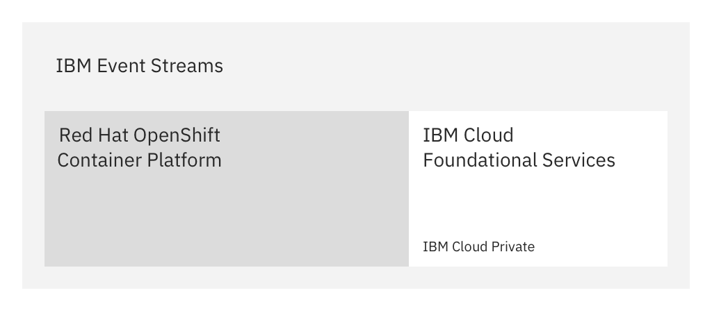
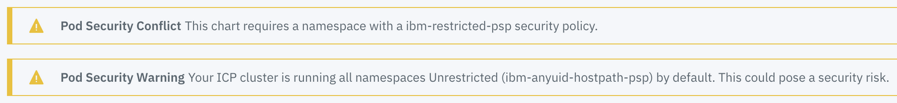

{{site.data.reuse.long_name}} makes using Apache Kafka in the enterprise easy and intuitive, and is now fully supported on the  {{site.data.reuse.openshift}}.

## Overview

You can install {{site.data.reuse.short_name}} on the {{site.data.reuse.openshift}}. The solution includes key IBM cloud foundational services such as installation, security, monitoring, and lifecycle management. These services help manage your {{site.data.reuse.short_name}} installation, and are provided by {{site.data.reuse.icp}}.



The benefits of the solution mean you have a container platform from which you can perform administrative tasks in Red Hat OpenShift while taking some foundational services {{site.data.reuse.short_name}} relies on from {{site.data.reuse.icp}}.

Any service task related to Kubernetes can be performed in both {{site.data.reuse.openshift}} and {{site.data.reuse.icp}}. For example, you can perform administrative tasks through either platform, such as managing storage, reviewing status of components, and reviewing logs and events from each component.

Certain aspects of managing your {{site.data.reuse.short_name}} installation require the use of the IBM cloud foundational services provided by {{site.data.reuse.icp}}. These services are as follows:
- Installing the chart
- Applying updates and fix packs
- Modifying installation settings
- Managing authentication and access (IAM)
- Reviewing metering
- Reviewing monitoring and metrics

**Important:** This documentation assumes the use of {{site.data.reuse.icp}} for the IBM cloud foundational services required for managing your {{site.data.reuse.short_name}} installation.

## Before you begin

- Ensure you have set up your environment [according to the prerequisites](../prerequisites), including setting up your {{site.data.reuse.openshift_short}} and your {{site.data.reuse.icp}} integration.
- Ensure you have [planned for your installation](../planning), such as planning for persistent volumes if required, and creating a ConfigMap for Kafka static configuration.
- Gather the following information from your administrator:\\
   - The master host and port for your {{site.data.reuse.icp}} cluster. These values are set during the installation of {{site.data.reuse.icp}}. The default port is 5443.\\
      Make a note of these values, and enter them in the steps that have `https://<Cluster Master Host>:<Cluster Master API Port>`
   - The master port for your {{site.data.reuse.openshift_short}} web console. The default port is 7443. The master host address is the same as the address for your {{site.data.reuse.icp}} cluster.\\
      Make a note of the port value, and enter that port together with the {{site.data.reuse.icp}} master host in the steps that have `https://<Cluster Master Host>:<OpenShift Master API Port>`
   - The SSH password if you are connecting remotely to the master host of your {{site.data.reuse.icp}} cluster.

**Note:** The installation process involves steps in both the web consoles and command lines of {{site.data.reuse.icp}} and {{site.data.reuse.openshift_short}}.

## Create a project (namespace)

You perform this step by using the {{site.data.reuse.openshift_short}} web console.

You must use a namespace that is dedicated to your {{site.data.reuse.short_name}} deployment. This is required because {{site.data.reuse.short_name}} uses network security policies to restrict network connections between its internal components.

If you plan to have multiple {{site.data.reuse.short_name}} instances, create namespaces to organize your {{site.data.reuse.long_name}} deployments into, and control user access to them.

When you create a project in the {{site.data.reuse.openshift_short}}, a namespace with the same name is also created. This is the namespace to use when installing your {{site.data.reuse.short_name}} instance.

1. Go to the {{site.data.reuse.openshift_short}} web console in your browser by using the URL `https://<Cluster Master Host>:<OpenShift Master API Port>`. The default port is 7443. The master host address is the same as the address for your {{site.data.reuse.icp}} cluster.
2. Log in using the user name and password provided to you by your administrator.
3. Create an OpenShift project for your {{site.data.reuse.short_name}} installation.\\
   For example, log into the {{site.data.reuse.openshift_short}} web console in your browser, click the **Create project** button, and type a unique name, display name, and description for the new project. This creates a project and a namespace.

## Download the archive

Download the {{site.data.reuse.long_name}} installation image file from the IBM Passport Advantage site, and save the archive to the host where the {{site.data.reuse.icp}} master cluster is installed.

Go to [IBM Passport Advantage](https://www.ibm.com/software/passportadvantage/pao_customer.html){:target="_blank"}, and search for "{{site.data.reuse.long_name}}". Download the images related to the part numbers for your platform (for example, the {{site.data.reuse.short_name}} package for the {{site.data.reuse.openshift}} includes `rhel` in the package name).


## Preparing the platform

Prepare your platform for installing {{site.data.reuse.short_name}} as follows.

**Important:** You must perform the following steps by using a terminal opened on the host where the {{site.data.reuse.icp}} master cluster is installed. If you are on a different host, you must first connect to the host machine by using SSH before logging in.

1. {{site.data.reuse.icp_cli_login}} The default port is 5443.
2. Run the following command to avoid certificate errors when running `kubectl` and `oc` commands later:\\
   `kubectl config set-cluster mycluster --insecure-skip-tls-verify=true`

<!--**Note:** Due to a known issue, running `kubectl` and `oc` commands might result in a certificate error. To permanently resolve this issue, edit the existing `cluster-ca-cert` system secret to add an additional certificate as described in {{site.data.reuse.icp}} [documentation](https://www.ibm.com/support/knowledgecenter/SSBS6K_3.1.2/supported_environments/openshift/known_issues_openshift.html#cert){:target="_blank"}.-->

### Run the setup script

You perform this step by using the {{site.data.reuse.icp}} CLI.

You must run the following setup script to prepare the platform.

1. Go to the {{site.data.reuse.short_name}} archive you downloaded from IBM Passport Advantage, and locate the file called `ibm-eventstreams-rhel-prod-<version>.tgz`.
3. Extract the PPA `tar.gz` archive, go to the `/charts` directory, and extract the chart `.tgz` archive
4. In your terminal window, change to the following directory: `/pak_extensions/pre-install`
4. Run the setup script as follows:\\
    `./scc.sh <namespace>`\\
    Where `<namespace>` is the namespace (project) you created for your {{site.data.reuse.short_name}} installation earlier.

### Look up the registry address

You perform this step by using the {{site.data.reuse.icp}} CLI.

Look up the internal OpenShift Docker registry address by using the following command:

`oc get svc docker-registry -n default`

The following is an example output:

```
NAME              TYPE        CLUSTER-IP      EXTERNAL-IP   PORT(S)    AGE
docker-registry   ClusterIP   198.51.100.24   <none>        5000/TCP   2d
```

The `<OpenShift_Docker_registry_address>` is made up of the values from the `CLUSTER-IP` and `PORT` fields as follows: `<CLUSTER-IP>:<PORT>`

In this example, the `<OpenShift_Docker_registry_address>` is `198.51.100.24:5000`. Make a note of the address, including the port number. You will need it later in the installation process.

### Load the archive into the catalog

Make the downloaded archive available in your catalog by using the {{site.data.reuse.icp}} CLI.

<!--If you are logging in remotely, connect to the host machine by using SSH before running the `cloudctl login` command.\\
   {{site.data.reuse.icp_cli_login}} The default port is 5443.-->

1. Log in to the Docker private image registry:\\
   `docker login -u any_value -p $(oc whoami -t) <OpenShift_Docker_registry_address>`

   Where the `<OpenShift_Docker_registry_address>` is the internal OpenShift Docker registry address you [looked up](#look-up-the-registry-address) earlier, including the port number, for example: `198.51.100.24:5000`.

   **Note:** The `docker login` command uses a session token (`oc whoami -t`) in the password field to perform authentication. This means the `-u` user name field is required, but not used by Docker.
2. Make the {{site.data.reuse.short_name}} Helm chart available in the catalog by using the compressed image you downloaded from IBM Passport Advantage.\\
   `cloudctl catalog load-ppa-archive --archive <PPA-image-name.tar.gz> --registry <OpenShift Docker registry address/namespace>`

   For example:\\
   `cloudctl catalog load-ppa-archive --archive eventstreams.rhel.2019.1.1.x86.pak.tar.gz --registry 198.51.100.24:5000/event-streams`

   When the image installation completes successfully, the catalog is updated with the {{site.data.reuse.long_name}} local chart, and the internal Docker repository is populated with the Docker images used by {{site.data.reuse.long_name}}.


## Preparing the repository

Prepare your repository for the installation as follows.

The following steps require you to run `kubectl` commands. To run the commands, you must be logged in to your {{site.data.reuse.icp}} cluster as an administrator.

1. {{site.data.reuse.icp_cli_login}} The default port is 5443.
2. Run the following command to avoid certificate errors when running `kubectl` and `oc` commands later:\\
   `kubectl config set-cluster mycluster --insecure-skip-tls-verify=true`

### Create an image pull secret

Create an image pull secret for the namespace where you intend to install {{site.data.reuse.short_name}} (this is the name of the project created earlier). The secret enables access to the internal Docker repository provided by the {{site.data.reuse.openshift_short}}.

To create a secret, use the following command:

`kubectl create secret docker-registry regcred --docker-server=<OpenShift_Docker_registry_address> --docker-username=<any_value> --docker-password=$(oc whoami -t) --docker-email=<any_value> -n <namespace>`

where:
- `--docker-server` is the internal OpenShift Docker registry address you [looked up](#look-up-the-registry-address) earlier.
- `--docker-username` can be any value. Docker uses a session token (`oc whoami -t`) in the password field to perform authentication. This means the `--docker-username` user name field is required, but not used by Docker.
- `--docker-email` can be any value. It is required, but not used by Docker.
- `-n`: is the project namespace (this is the name of the [project](#create-a-project-namespace) created earlier).

For example:

`kubectl create secret docker-registry regcred --docker-server=198.51.100.24:5000 --docker-username=user --docker-password=$(oc whoami -t) --docker-email=john.smith@ibm.com -n event-streams`

For more information about creating image pull secrets, see the {{site.data.reuse.icp}} [documentation](https://www.ibm.com/support/knowledgecenter/SSBS6K_3.1.2/manage_images/imagepullsecret.html){:target="_blank"}.

### Create an image policy

Create an image policy for the internal Docker repository. The policy enables images to be retrieved during installation.\\
To create an image policy:

1. Create a `.yaml` file with the following content, then replace `<OpenShift_Docker_registry_address>` with the address you [looked up](#look-up-the-registry-address) earlier, and replace the `<namespace_for_event_streams>` value with the [project](#create-a-project-namespace) name where you intend to install {{site.data.reuse.long_name}} (set as `-n event-streams` in the previous example):
```
apiVersion: securityenforcement.admission.cloud.ibm.com/v1beta1
kind: ImagePolicy
metadata:
  name: image-policy
  namespace: <namespace_for_event_streams>
spec:
  repositories:
  - name: docker.io/*
       policy: null
  - name: <OpenShift_Docker_registry_address>/*
       policy: null
```
2. Run the following command: `kubectl apply -f <filename>.yaml`

For more information about container image security, see the {{site.data.reuse.icp}} [documentation](https://www.ibm.com/support/knowledgecenter/SSBS6K_3.1.2/manage_images/image_security.html){:target="_blank"}.

## Installing the {{site.data.reuse.short_name}} chart

You perform this step in a browser by using the {{site.data.reuse.icp}} cluster management console.

Install the {{site.data.reuse.short_name}} chart as follows.

1. {{site.data.reuse.icp_ui_login}} The default port is 5443.\\
   Ensure you log in as a user that has the Cluster Administrator role.
2. Click **Catalog** in the top navigation menu.
2. Search for `ibm-eventstreams-rhel-prod` and select it from the result. The {{site.data.reuse.long_name}} README is displayed.
3. Click **Configure**.\\
   **Note:** The README includes information about how to install {{site.data.reuse.long_name}} by using the the CLI. To use the CLI, follow the instructions in the README instead of clicking **Configure**.\\
   **Important**: You might see the following warnings on this page. These warnings are harmless and can be safely ignored as the {{site.data.reuse.openshift_short}} does not use PodSecurityPolicy settings.\\
   
4. Enter a release name that identifies your {{site.data.reuse.short_name}} installation, select the target namespace you created previously, and accept the terms of the license agreement.
5. Expand the **All parameters** section to configure the settings for your installation as described in [configuring](../configuring). Configuration options to consider include setting up persistent storage, external access, and preparing for geo-replication.\\
   **Important:** As part of the configuration process, enter the name of the [secret](#preparing-the-repository) you created previously in the [**Image pull secret**](../configuring/#global-install-settings) field.\\
   **Note:** Ensure the [**Docker image registry**](../configuring/#global-install-settings) field value includes the OpenShift Docker registry address and the namespace, for example: `198.51.100.24:5000/event-streams`
6. Click **Install**.
7. [Verify your installation](../post-installation/#verifying-your-installation) and consider other post-installation tasks, such as [fixing certificate errors](../post-installation/#red-hat-openshift-only-fixing-certificate-errors) affecting the {{site.data.reuse.icp}} CLI.
