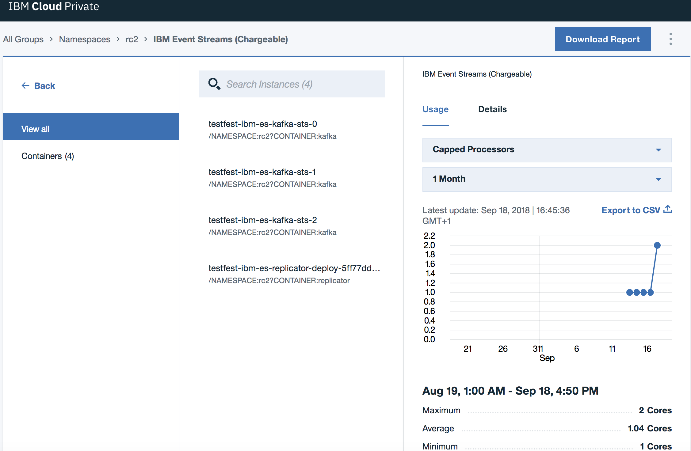
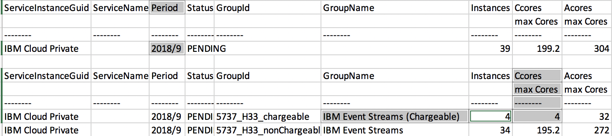

Consider the following when planning your installation.

## Available editions

{{site.data.reuse.long_name}} is available in two editions:

- **{{site.data.reuse.ce_long}}** is a free version intended for trial and demonstration purposes. It can be installed and used without charge. You can [install the {{site.data.reuse.ce_short}}](../trying-out/) from the catalog included with {{site.data.reuse.icp}}.

- **{{site.data.reuse.long_name}}** is the paid-for version intended for enterprise use, and includes full IBM support and additional features such as geo-replication. You can install {{site.data.reuse.long_name}} by downloading the image from IBM Passport Advantage, and making it available in the {{site.data.reuse.icp}} catalog.

**Note:** If you do not have {{site.data.reuse.icp}} already, {{site.data.reuse.long_name}} includes entitlement to {{site.data.reuse.icp_foundation}} which you can download from IBM Passport Advantage as well, and [install as a prerequisite](https://www.ibm.com/support/knowledgecenter/SSBS6K_3.2.1/installing/install_containers.html){:target="_blank"}. {{site.data.reuse.icp_foundation}} can only be used to deploy {{site.data.reuse.long_name}}. No other service can be deployed without [upgrading {{site.data.reuse.icp}}](https://www.ibm.com/support/knowledgecenter/SSBS6K_3.2.1/getting_started/bundles.html){:target="_blank"}.

<!--
**Note:** {{site.data.reuse.long_name}} Foundation is also available for embedding in IBM products.
-->

## Performance considerations

When preparing for your {{site.data.reuse.short_name}} installation, review your workload requirements and consider the configuration options available for performance tuning both your {{site.data.reuse.icp}} and {{site.data.reuse.short_name}} installations. For more information, see the [performance planning topic](../capacity-planning).

## Kafka high availability

Kafka is designed for high availability and fault tolerance.

To reduce the impact of {{site.data.reuse.short_name}} Kafka broker failures, spread your [brokers](../configuring/#kafka-broker-settings) across several {{site.data.reuse.icp}} [worker nodes](https://www.ibm.com/support/knowledgecenter/en/SSBS6K_3.2.1/installing/add_node.html){:target="_blank"} by ensuring you have at least as many worker nodes as  brokers. For example, for 3 Kafka brokers, ensure you have at least 3 worker nodes running on separate physical servers.

Kafka ensures that topic-partition replicas are spread across available brokers up to the replication factor specified. Usually, all of the replicas will be in-sync, meaning that they are all fully up-to-date, although some replicas can temporarily be out-of-sync, for example, when a broker has just been restarted.

The replication factor controls how many replicas there are, and the minimum in-sync configuration controls how many of the replicas need to be in-sync for applications to produce and consume messages with no loss of function. For example, a typical configuration has a replication factor of 3 and minimum in-sync replicas set to 2. This configuration can tolerate 1 out-of-sync replica, or 1 worker node or broker outage with no loss of function, and 2 out-of-sync replicas, or 2 worker node or broker outages with loss of function but no loss of data.

The combination of brokers spread across nodes together with the replication feature make a single {{site.data.reuse.short_name}} cluster highly available.

## Multizone support

To add further resilience to your clusters, you can also split your servers across multiple data centers or zones, so that even if one zone experiences a failure, you still have a working system.

[Multizone support](https://kubernetes.io/docs/setup/best-practices/multiple-zones/){:target="_blank"} provides the option to run a single Kubernetes cluster in multiple availability zones within the same region. Multizone clusters are clusters of either physical or virtual servers that are spread over different locations to achieve greater resiliency. If one location is shut down for any reason, the rest of the cluster is unaffected.

**Note:** For {{site.data.reuse.short_name}} to work effectively within a multizone cluster, the network latency between zones must not be greater than 20 ms for Kafka to replicate data to the other brokers.

Your Kubernetes container platforms can be zone aware or non-zone aware:

- Zone-aware platforms set up your clusters in multiple availability zones automatically by allocating your application resources evenly across the zones.
- Non-zone-aware platforms require you to manually prepare your clusters for multiple zones by specifying labels for nodes, and then providing the labels for the zones during the installation of {{site.data.reuse.short_name}}.

For information about how to determine whether your clusters are zone aware or not, and to get ready for installing into multiple zones, see [preparing for multizone clusters](../preparing-multizone).

<!-- **COMMENT:** _The terminology to use based on some research is: "multizone", "multiple availability zones", zone aware (n), zone-aware (adj), non-zone aware (n), and non-zone-aware (adj)._ -->

## Persistent storage

Persistence is not enabled by default, so no persistent volumes are required. Enable persistence if you want your data, such as messages in topics, schemas, and configuration settings to be retained in the event of a restart. You should enable persistence for production use and whenever you want your data to survive a restart.

If you plan to have persistent volumes, [consider the disk space](../capacity-planning/#disk-space-for-persistent-volumes) required for storage.

Also, as both Kafka and ZooKeeper rely on fast write access to disks, ensure you use separate dedicated disks for storing Kafka and ZooKeeper data. For more information, see the disks and filesystems guidance in the [Kafka documentation](https://kafka.apache.org/documentation/#diskandfs){:target="_blank"}, and the deployment guidance in the [ZooKeeper documentation](https://zookeeper.apache.org/doc/r3.1.2/zookeeperAdmin.html#sc_designing){:target="_blank"}.

If persistence is enabled, each Kafka broker and ZooKeeper server requires one physical volume each. The number of Kafka brokers and ZooKeeper servers depends on your setup, for default requirements, see the [resource requirements table](../prerequisites/#helm-resource-requirements). Schema registry requires a single physical volume. You either need to create a [persistent volume](https://kubernetes.io/docs/concepts/storage/persistent-volumes/#static){:target="_blank"} for each physical volume, or specify a storage class that supports [dynamic provisioning](https://kubernetes.io/docs/concepts/storage/persistent-volumes/#dynamic){:target="_blank"}. Each component can use a different storage class to control how physical volumes are allocated.

**Note:** When creating persistent volumes backed by an NFS file system, ensure the path provided has the access permission set to `775`.

See the {{site.data.reuse.icp}} documentation for information about [creating persistent volumes](https://www.ibm.com/support/knowledgecenter/SSBS6K_3.2.1/manage_cluster/pv_land.html){:target="_blank"} and [creating a storage class](https://www.ibm.com/support/knowledgecenter/SSBS6K_3.2.1/manage_cluster/sc_land.html){:target="_blank"} that supports dynamic provisioning. For both, you must have the {{site.data.reuse.icp}} Cluster Administrator role.

**Important:** When creating persistent volumes for each component, ensure the correct **Access mode** is set for the volumes as described in the following table.

| Component       | Access mode                      |
| --------------- | -------------------------------- |
| Kafka           | `ReadWriteOnce`                  |
| ZooKeeper       | `ReadWriteOnce`                  |
| Schema registry | `ReadWriteMany or ReadWriteOnce` |

More information about persistent volumes and the system administration steps required before installing {{site.data.reuse.long_name}} can be found in the [Kubernetes documentation](https://kubernetes.io/docs/concepts/storage/persistent-volumes/){:target="_blank"}.

If these persistent volumes are to be created manually, this must be done by the system administrator before installing {{site.data.reuse.long_name}}. The administrator will add these to a central pool before the Helm chart can be installed. The installation will then claim the required number of persistent volumes from this pool.

If these persistent volumes are to be created automatically, run a [provisioner](https://kubernetes.io/docs/concepts/storage/storage-classes/#provisioner){:target="_blank"} for the the storage class you want to use. See the list of [file systems](../prerequisites/#file-systems-for-storage) for storage supported by {{site.data.reuse.short_name}}.

If you want to use persistent storage, enable it when [configuring](../configuring/#enabling-persistent-storage) your {{site.data.reuse.short_name}} installation, and provide the storage class details as required.

{{site.data.reuse.fsGroupGid}}

### Using IBM Spectrum Scale

If you are using IBM Scpectrum Scale for persistence, see the IBM Storage Enabler for Containers with IBM Spectrum Scale documentation for more information about [creating storage classes](https://www.ibm.com/support/knowledgecenter/en/SSCKLT_2.1.0/UG/sec_ug_config_storage_class_pvc_file.html){:target="_blank"}.

The system administrator must enable support for the automatic creation of persistent volumes prior to installing {{site.data.reuse.short_name}}. To do this, enable **dynamic provisioning** when [configuring your installation](../configuring/#enabling-persistent-storage), and provide the storage class names to define the persistent volumes that get allocated to the deployment.

**Note:** When creating storage classes for an IBM Spectrum Scale file system, ensure you specify both the UID and GID in the storage class definition. Then, when installing {{site.data.reuse.short_name}}, ensure you set the [**File system group ID**](../configuring#global-install-settings) field to the GID specified in the storage class definition. Also, ensure that this user exists on all IBM Spectrum Scale and GUI nodes.

## Securing communication between pods

You can enhance your security by encrypting the internal communication between {{site.data.reuse.short_name}} pods by using TLS. By default, TLS communication between pods is disabled.

You can enable encryption between pods when [configuring](../configuring/#enabling-encryption-between-pods) your {{site.data.reuse.short_name}} installation.

You can also enable TLS encryption between pods for [existing](../../security/encrypting-data/#enabling-encryption-between-pods) {{site.data.reuse.short_name}} installations.

**Important:** If you are using the paid-for version of {{site.data.reuse.short_name}} (not {{site.data.reuse.ce_short}}), all message data is encrypted using TLS, but communication between the geo-replicator and administration server pods is not encrypted (see tables in [resource requirements](../prerequisites/#helm-resource-requirements)).

## ConfigMap for Kafka static configuration

You can choose to create a ConfigMap to specify Kafka configuration settings for your {{site.data.reuse.long_name}} installation. This is optional.

You can use a ConfigMap to override default Kafka configuration settings [when installing](../configuring/#specifying-a-configmap-for-kafka-configuration) {{site.data.reuse.long_name}}.

You can also use a ConfigMap to modify read-only Kafka broker settings for an existing {{site.data.reuse.long_name}} installation. Read-only parameters are defined by Kafka as settings that require a broker restart. [Find out more](../../administering/modifying-configs/) about the Kafka configuration options and how to modify them for an existing installation.

To create a ConfigMap:
1. {{site.data.reuse.icp_cli_login321}}\\
  **Note:** To create a ConfigMap, you must have the Team Operator, Team Administrator, or Cluster Administrator role in {{site.data.reuse.icp}}.
2. To create a ConfigMap from an existing Kafka `server.properties` file, use the following command (where namespace is where you install {{site.data.reuse.short_name}}):\\
  `kubectl -n <namespace_name> create configmap <configmap_name> --from-env-file=<full_path/server.properties>`
3. To create a blank ConfigMap for future configuration updates, use the following command:\\
  `kubectl -n <namespace_name> create configmap <configmap_name>`

## Geo-replication

You can deploy multiple instances of {{site.data.reuse.long_name}} and use the included geo-replication feature to synchronize data between your clusters. Geo-replication helps maintain service availability.

[Find out more](../../georeplication/about/) about geo-replication.

[Prepare your destination cluster](../configuring/#setting-geo-replication-nodes) by setting the number of geo-replication worker nodes during installation.

{{site.data.reuse.geo-rep_note}}

## Connecting clients

By default, Kafka client applications connect to the {{site.data.reuse.icp}} master node directly without any configuration required. If you want clients to connect through a different route, [specify the target endpoint](../configuring/#configuring-external-access) host name or IP address when configuring your installation.

## Logging

{{site.data.reuse.icp}} uses the Elastic Stack for managing logs (Elasticsearch, Logstash, and Kibana products). {{site.data.reuse.long_name}} logs are written to `stdout` and are picked up by the default Elastic Stack setup.

Consider setting up the {{site.data.reuse.icp}} logging for your environment to help resolve problems with your deployment and aid general troubleshooting. See the {{site.data.reuse.icp}} documentation [about logging](https://www.ibm.com/support/knowledgecenter/SSBS6K_3.2.1/manage_metrics/logging_elk.html){:target="_blank"} for information about the built-in Elastic Stack.

As part of setting up the {{site.data.reuse.icp}} logging for {{site.data.reuse.long_name}}, ensure you consider the following:
* [Capacity planning guidance for logging](https://www.ibm.com/support/knowledgecenter/SSBS6K_3.2.1/manage_metrics/capacity_planning.html){:target="_blank"}: set up your system to have sufficient resources towards the capture, storage, and management of logs.
* [Log retention](https://www.ibm.com/support/knowledgecenter/SSBS6K_3.2.1/manage_metrics/log_config.html){:target="_blank"}: The logs captured using the Elastic Stack persist during restarts. However, logs older than a day are deleted at midnight by default to prevent log data from filling up available storage space. Consider changing the log data retention in line with your capacity planning. Longer retention of logs provides access to older data that might help troubleshoot problems.

You can use log data to investigate any problems affecting your [system health](../../administering/deployment-health/).

## Monitoring Kafka clusters

{{site.data.reuse.long_name}} uses the {{site.data.reuse.icp}} monitoring service to provide you with information about the health of your {{site.data.reuse.short_name}} Kafka clusters. You can view data for the last 1 hour, 1 day, 1 week, or 1 month in the metrics charts.

{{site.data.reuse.monitor_metrics_retention}}

For more information about keeping an eye on the health of your Kafka cluster, see the [monitoring Kafka](../../administering/cluster-health/) topic.

## Licensing

You require a license to use {{site.data.reuse.long_name}}. Licensing is based on a Virtual Processing Cores (VPC) metric.

An {{site.data.reuse.long_name}} deployment consists of a number of different types of containers, as described in the [components of the Helm chart](../prerequisites/#helm-resource-requirements). To use {{site.data.reuse.long_name}} you must have a license for all of the virtual cores that are available to all Kafka and Geo-replicator containers deployed. All other container types are pre-requisite components that are supported as part of {{site.data.reuse.long_name}}, and do not require additional licenses.

The number of virtual cores available to each Kafka and geo-replicator container can be specified [during installation](../configuring/#kafka-broker-settings) or [modified later](../../administering/modifying-configs/).

To check the number of cores, use the {{site.data.reuse.icp}} metering report as follows:

1. {{site.data.reuse.icp_ui_login321}}
2. From the navigation menu, click **Platform > Metering**.
3. Select your namespace, and select **{{site.data.reuse.long_name}} (Chargeable)**.
4. Click **Containers**.
5. Go to the **Containers** section on the right, and ensure you select the **Usage** tab.
6. Select **Capped Processors** from the first drop-down list, and select **1 Month** from the second drop-down list.\\
   A page similar to the following is displayed:\\
   
7. Click **Download Report**, and save the CSV file to a location of your choice.
8. Open the downloaded report file.
9. Look for the month in **Period**, for example, **2018/9**, then in the rows underneath look for **{{site.data.reuse.long_name}} (Chargeable)**, and check the **CCores/max Cores** column. The value is the maximum aggregate number of cores provided to all Kafka and geo-replicator containers. You are charged based on this number.\\
   For example, the following excerpt from a downloaded report shows that for the period 2018/9 the chargeable {{site.data.reuse.long_name}} containers had a total of 4 cores available (see the highlighted fields):\\
   
