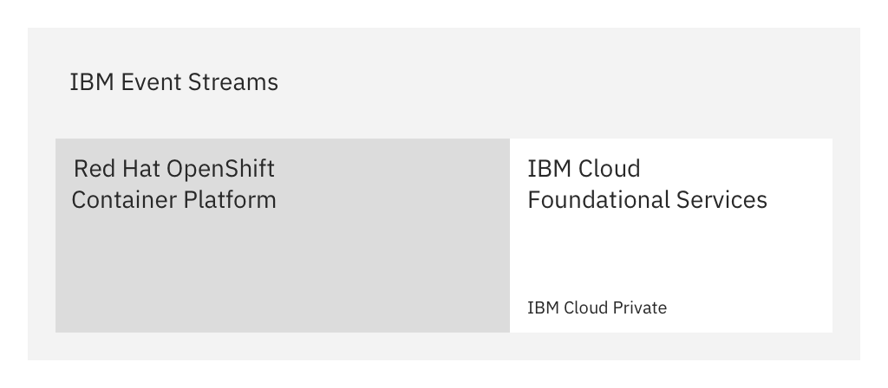
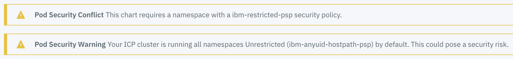

{{site.data.reuse.long_name}} makes using Apache Kafka in the enterprise easy and intuitive, and is now fully supported on the  {{site.data.reuse.openshift}}.

## Overview

You can install {{site.data.reuse.short_name}} on the {{site.data.reuse.openshift}}. The solution includes key IBM cloud foundational services such as installation, security, monitoring, and lifecycle management. These services help manage your {{site.data.reuse.short_name}} installation, and are provided by {{site.data.reuse.icp}}.



The benefits of the solution mean you have a container platform from which you can perform administrative tasks in Red Hat OpenShift while taking some foundational services {{site.data.reuse.short_name}} relies on from {{site.data.reuse.icp}}.

Any service task related to Kubernetes can be performed in both {{site.data.reuse.openshift}} and {{site.data.reuse.icp}}. For example, you can perform administrative tasks through either platform, such as managing storage, reviewing status of components, and reviewing logs and events from each component.

Certain aspects of managing your {{site.data.reuse.short_name}} installation require the use of the IBM cloud foundational services provided by {{site.data.reuse.icp}}. These services are as follows:
- Installing the chart
- Applying updates and fix packs
- Modifying installation settings
- Managing authentication and access (IAM)
- Reviewing metering
- Reviewing monitoring and metrics

**Important:** This documentation assumes the use of {{site.data.reuse.icp}} for the IBM cloud foundational services required for managing your {{site.data.reuse.short_name}} installation.

## Before you begin

- Ensure you have set up your environment [according to the prerequisites](../prerequisites), including setting up your {{site.data.reuse.openshift_short}} and your {{site.data.reuse.icp}} integration.
- Ensure you have [planned for your installation](../planning), such as planning for persistent volumes if required, and creating a ConfigMap for Kafka static configuration.
- Gather the following information from your administrator:\\
   - The connection details for your {{site.data.reuse.icp}} cluster in the format `<cluster_address>:<cluster_router_https_port>`.
      An administrator can retrieve these details from the ConfigMap in `kube-public` as follows:

      `kubectl get cm ibmcloud-cluster-info -n kube-public -o yaml`

      See the `cluster_address` value for the master address, and the `cluster_router_https_port` for the port number.

   - The connection details for your {{site.data.reuse.openshift_short}} cluster.

## Create a project (namespace)

You perform this step by using the {{site.data.reuse.openshift_short}} command line.

You must use a namespace that is dedicated to your {{site.data.reuse.short_name}} deployment. This is required because {{site.data.reuse.short_name}} uses network security policies to restrict network connections between its internal components.

If you plan to have multiple {{site.data.reuse.short_name}} instances, create namespaces to organize your {{site.data.reuse.long_name}} deployments into, and control user access to them.

When you create a [project](https://docs.openshift.com/container-platform/3.11/dev_guide/projects.html){:target="_blank"} in the {{site.data.reuse.openshift_short}}, a namespace with the same name is also created. This is the namespace to use when installing your {{site.data.reuse.short_name}} instance.

You can create a project by using the web console or the CLI. For example, to create a project by using the CLI:

```
oc login -u=<username> -p=<password> --server=<your-openshift-server> --insecure-skip-tls-verify
oc new-project <project_name> --description="<description>" --display-name="<display_name>"
```

## Download the archive

Download the {{site.data.reuse.long_name}} installation image file from the IBM Passport Advantage site, and save the archive to the host where the {{site.data.reuse.icp}} master cluster is installed.

Go to [IBM Passport Advantage](https://www.ibm.com/software/passportadvantage/pao_customer.html){:target="_blank"}, and search for "{{site.data.reuse.long_name}}".


## Preparing the platform

For the following steps, log in to {{site.data.reuse.icp}} to prepare your platform for installing {{site.data.reuse.short_name}}. {{site.data.reuse.icp_cli_login321}}

### Run the setup script

You perform this step by using the {{site.data.reuse.icp}} CLI.

You must run the following setup script to prepare the platform.

1. Go to the {{site.data.reuse.short_name}} archive you downloaded from IBM Passport Advantage, and locate the file called `ibm-eventstreams-prod-<version>.tgz`.
3. Extract the PPA `tar.gz` archive, go to the `/charts` directory, and extract the chart `.tgz` archive.
4. In your terminal window, change to the following directory: `/pak_extensions/pre-install`
4. Run the setup script as follows:\\
    `./scc.sh <namespace>`\\
    Where `<namespace>` is the namespace (project) you created for your {{site.data.reuse.short_name}} installation earlier.

### Look up the registry address

You perform this step by using the {{site.data.reuse.openshift_short}} command line.

Look up the internal OpenShift Docker registry address by using the following command:

`kubectl get routes docker-registry -n default`

The following is an example output:

```
NAME              HOST/PORT                                               PATH  SERVICES          PORT    TERMINATION   WILDCARD
docker-registry   docker-registry-default.apps.cluster-abc.my-domain.com        docker-registry   <all>   passthrough   None
```

The `<OpenShift_Docker_registry_address>` is the values of the `HOST/PORT` field.

**Note:** You can only retrieve the address if your docker registry is [exposed](https://docs.openshift.com/container-platform/3.11/install_config/registry/securing_and_exposing_registry.html){:target="_blank"}.

### Load the archive into the catalog

Make the downloaded archive available in your catalog by using the {{site.data.reuse.icp}} CLI.

1. Log in to the Docker private image registry:\\
   `docker login -u any_value -p $(oc whoami -t) <OpenShift_Docker_registry_address>`

   Where the `<OpenShift_Docker_registry_address>` is the internal OpenShift Docker registry address you [looked up](#look-up-the-registry-address) earlier.

   **Note:** The `docker login` command uses a session token (`oc whoami -t`) in the password field to perform authentication. This means the `-u` user name field is required, but not used by Docker.
2. Make the {{site.data.reuse.short_name}} Helm chart available in the catalog by using the compressed image you downloaded from IBM Passport Advantage.\\
   `cloudctl catalog load-ppa-archive --archive <PPA-image-name.tar.gz> --registry <OpenShift Docker registry address>/<namespace-to-install-into>`

   For example:\\
   `cloudctl catalog load-ppa-archive --archive eventstreams.2019.4.1.z_x86.pak.tar.gz --registry docker-registry-default.apps.cluster-abc.my-domain.com/event-streams`

   When the image installation completes successfully, the catalog is updated with the {{site.data.reuse.long_name}} local chart, and the internal Docker repository is populated with the Docker images used by {{site.data.reuse.long_name}}.


## Preparing the repository

Prepare your repository by creating an image policy.

**Note:** You only need to follow these steps if the `image-security-enforcement` [service](https://www.ibm.com/support/knowledgecenter/SSBS6K_3.2.1/manage_images/image_security.html){:target="_blank"} is enabled. If the service is not enabled, you can ignore these steps.

The following steps require you to run `kubectl` commands. To run the commands, you must be logged in to your {{site.data.reuse.icp}} cluster as an administrator. Log in as described in [earlier](#preparing-the-platform).

Create an image policy for the internal Docker repository. The policy enables images to be retrieved during installation.

To create an image policy:

1. Create a `.yaml` file with the following content, then replace `<OpenShift_Docker_registry_address>` with the address you [looked up](#look-up-the-registry-address) earlier, and replace the `<namespace_for_event_streams>` value with the [project](#create-a-project-namespace) name where you intend to install {{site.data.reuse.long_name}} (set as `-n event-streams` in the previous example):
```
apiVersion: securityenforcement.admission.cloud.ibm.com/v1beta1
kind: ImagePolicy
metadata:
  name: image-policy
  namespace: <namespace_for_event_streams>
spec:
  repositories:
  - name: docker.io/*
       policy: null
  - name: <OpenShift_Docker_registry_address>/*
       policy: null
```
2. Run the following command: `kubectl apply -f <filename>.yaml`

For more information about container image security, see the {{site.data.reuse.icp}} [documentation](https://www.ibm.com/support/knowledgecenter/SSBS6K_3.2.1/manage_images/image_security.html){:target="_blank"}.


## Installing the {{site.data.reuse.short_name}} chart

You perform this step in a browser by using the {{site.data.reuse.icp}} cluster management console.

Install the {{site.data.reuse.short_name}} chart as follows.

1. {{site.data.reuse.icp_ui_login321}}\\
   Ensure you log in as a user that has the Team Administrator or Cluster Administrator role.
2. Click **Catalog** in the top navigation menu.
2. Search for `ibm-eventstreams-prod` and select it from the result. The {{site.data.reuse.long_name}} README is displayed.
3. Click **Configure**.\\
   **Note:** The README includes information about how to install {{site.data.reuse.long_name}} by using the CLI. To use the CLI, follow the instructions in the README instead of clicking **Configure**.\\
   **Important**: You might see the following warnings on this page. These warnings are harmless and can be safely ignored as the {{site.data.reuse.openshift_short}} does not use PodSecurityPolicy settings.\\
   
4. {{site.data.reuse.enter_install_details}}
5. Expand the **All parameters** section to configure the settings for your installation as described in [configuring](../configuring). Configuration options to consider include setting up persistent storage, external access, and preparing for geo-replication.\\
     **Note:** Ensure the [**Docker image registry**](../configuring/#global-install-settings) field value includes the internal OpenShift Docker registry address and the namespace, for example: `docker-registry.default.svc:5000/event-streams`
6. Click **Install**.
7. [Verify your installation](../post-installation/#verifying-your-installation) and consider other post-installation tasks.
