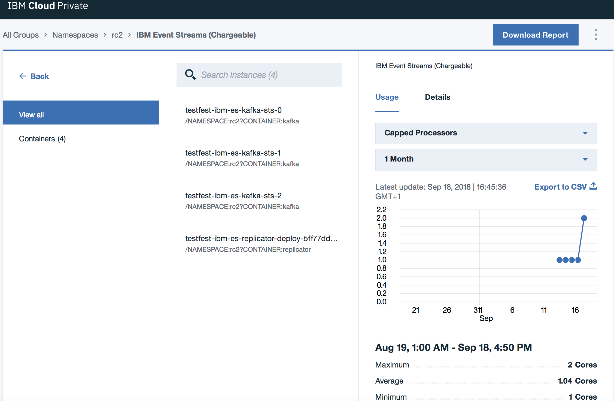
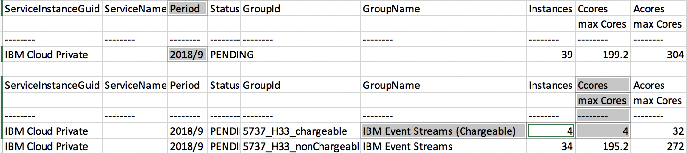

Consider the following when planning your installation.

## {{site.data.reuse.ce_long}}

The {{site.data.reuse.ce_long}} is a free version intended for trial and demonstration purposes. It can be installed and used without charge.

You can [install the {{site.data.reuse.ce_short}}](../installing/#trying-out-event-streams) from the catalog included with {{site.data.reuse.icp}}.

## {{site.data.reuse.long_name}}

{{site.data.reuse.long_name}} is the paid-for version intended for enterprise use, and includes full IBM support and additional features such as geo-replication.

You can [install {{site.data.reuse.long_name}}](../installing/#installing-ibm-event-streams) by downloading the image from IBM Passport Advantage, and making it available in the {{site.data.reuse.icp}} catalog.

**Note:** If you do not have {{site.data.reuse.icp}} already, {{site.data.reuse.long_name}} includes entitlement to {{site.data.reuse.icp_foundation}} which you can download from IBM Passport Advantage as well, and [install as a prerequisite](https://www.ibm.com/support/knowledgecenter/SSBS6K_3.1.1/installing/install_containers.html). {{site.data.reuse.icp_foundation}} can only be used to deploy {{site.data.reuse.long_name}}. No other service can be deployed without [upgrading {{site.data.reuse.icp}}](https://www.ibm.com/support/knowledgecenter/SSBS6K_3.1.1/getting_started/bundles.html).

<!--
**Note:** {{site.data.reuse.long_name}} Foundation is also available for embedding in IBM products.
-->

## Namespaces

You must use a namespace that is dedicated to your {{site.data.reuse.short_name}} deployment. This is required because {{site.data.reuse.short_name}} uses network security policies to restrict network connections between its internal components.

If you plan to have multiple {{site.data.reuse.short_name}} instances, create namespaces to organize your {{site.data.reuse.long_name}} deployments into, and control user access to them.

You must have the `ibm-restricted-psp` PodSecurityPolicy selected for the target namespace.

To create a namespace, you must have the Cluster administrator role. See the {{site.data.reuse.icp}} documentation for more information about [creating namespaces](https://www.ibm.com/support/knowledgecenter/SSBS6K_3.1.1/user_management/create_project.html).

## Persistent storage

Persistence is not enabled by default, so no persistent volumes are required. Enable persistence if you want messages in topics and configuration settings to be retained in the event of a restart. You should enable persistence for production use and whenever you want your data to survive a restart.

If you plan to have persistent volumes, [consider the disk space](../capacity-planning/) required for storage.

If persistence is enabled, each Kafka broker and ZooKeeper server requires one physical volume each. You either need to create a [persistent volume](https://kubernetes.io/docs/concepts/storage/persistent-volumes/#static) for each Kafka broker and ZooKeeper server, or specify a storage class that supports [dynamic provisioning](https://kubernetes.io/docs/concepts/storage/persistent-volumes/#dynamic). Kafka and ZooKeeper can use different storage classes to control how physical volumes are allocated.

See the {{site.data.reuse.icp}} documentation for information about [creating persistent volumes](https://www.ibm.com/support/knowledgecenter/SSBS6K_3.1.1/manage_cluster/pv_land.html) and [creating a storage class](https://www.ibm.com/support/knowledgecenter/SSBS6K_3.1.1/manage_cluster/sc_land.html) that supports dynamic provisioning. For both, you must have the {{site.data.reuse.icp}} Cluster administrator role.

**Important:** When creating persistent volumes to use with {{site.data.reuse.long_name}}, ensure you set **Access mode** to `ReadWriteOnce`.

More information about persistent volumes and the system administration steps required before installing {{site.data.reuse.long_name}} can be found in the [Kubernetes documentation](https://kubernetes.io/docs/concepts/storage/persistent-volumes/).

If these persistent volumes are to be created manually, this must be done by the system administrator before installing {{site.data.reuse.long_name}}. The administrator will add these to a central pool before the Helm chart can be installed. The installation will then claim the required number of persistent volumes from this pool. For manual creation, **dynamic provisioning** must be disabled when [configuring your installation](../configuring/#enabling-persistent-storage). It is up to the administrator to provide appropriate storage to contain these physical volumes.

If these persistent volumes are to be created automatically at the time of installation, the system administrator must enable support for this prior to installing {{site.data.reuse.long_name}}. For automatic creation, enable **dynamic provisioning** when [configuring your installation](../configuring/#enabling-persistent-storage), and provide the storage class names to define the persistent volumes that get allocated to the deployment.

{{site.data.reuse.fsGroupGid}}

## ConfigMap for Kafka static configuration

You can choose to create a ConfigMap to specify Kafka configuration settings for your {{site.data.reuse.long_name}} installation. This is optional.

You can use a ConfigMap to override default Kafka configuration settings [when installing](../configuring/#specifying-a-configmap-for-kafka-configuration) {{site.data.reuse.long_name}}.

You can also use a ConfigMap to modify read-only Kafka broker settings for an existing {{site.data.reuse.long_name}} installation. Read-only parameters are defined by Kafka as settings that require a broker restart. [Find out more](../../administering/modifying-configs/) about the Kafka configuration options and how to modify them for an existing installation.

To create a ConfigMap:
1. {{site.data.reuse.icp_cli_login}}\\
  **Note:** To create a ConfigMap, you must have the Operator, Administrator, or Cluster administrator role in {{site.data.reuse.icp}}.
2. To create a ConfigMap from an existing Kafka `server.properties` file, use the following command:\\
  `kubectl -n <namespace_name> create configmap <configmap_name> --from-env-file=<full_path/server.properties>`
3. To create a blank ConfigMap for future configuration updates, use the following command:\\
  `kubectl -n <namespace_name> create configmap <configmap_name>`

## Geo-replication

You can deploy multiple instances of {{site.data.reuse.long_name}} and use the included geo-replication feature to synchronize data between your clusters. Geo-replication helps maintain service availability.

[Find out more](../../georeplication/about/) about geo-replication.

[Prepare your destination cluster](../configuring/#setting-geo-replication-nodes) by setting the number of geo-replication worker nodes during installation.

{{site.data.reuse.geo-rep_note}}

## Connecting clients

By default, Kafka client applications connect to the {{site.data.reuse.icp}} master node directly without any configuration required. If you want clients to connect through a different route, [specify the target endpoint](../configuring/#configuring-external-access) host name or IP address when configuring your installation.

## Sizing considerations

Consider the capacity requirements of your deployment before installing {{site.data.reuse.long_name}}. See the [information about scaling](../../administering/scaling/) for guidance. You can modify the capacity settings for existing installations as well.

## Logging

{{site.data.reuse.icp}} uses the Elastic Stack for managing logs (Elasticsearch, Logstash, and Kibana products). {{site.data.reuse.long_name}} logs are written to `stdout` and are picked up by the default Elastic Stack setup.

Consider setting up the {{site.data.reuse.icp}} logging for your environment to help resolve problems with your deployment and aid general troubleshooting. See the {{site.data.reuse.icp}} documentation [about logging](https://www.ibm.com/support/knowledgecenter/SSBS6K_3.1.1/manage_metrics/logging_elk.html) for information about the built-in Elastic Stack.

As part of setting up the {{site.data.reuse.icp}} logging for {{site.data.reuse.long_name}}, ensure you consider the following:
* [Capacity planning guidance](https://www.ibm.com/support/knowledgecenter/SSBS6K_3.1.1/manage_metrics/capacity_planning.html): set up your system to have sufficient resources towards the capture, storage, and management of logs.
* [Log retention](https://www.ibm.com/support/knowledgecenter/SSBS6K_3.1.1/manage_metrics/logging_elk.html#curator-usage-in-ibm-cloud-private): The logs captured using the Elastic Stack persist during restarts. However, logs older than a day are deleted at midnight by default to prevent log data from filling up available storage space. Consider changing the log data retention in line with your capacity planning. Longer retention of logs provides access to older data that might help troubleshoot problems.

You can use log data to investigate any problems affecting your [system health](../../administering/deployment-health/).

## Monitoring Kafka clusters

{{site.data.reuse.long_name}} uses the {{site.data.reuse.icp}} monitoring service to provide you with information about the health of your {{site.data.reuse.short_name}} Kafka clusters. You can view data for the last 1 hour, 1 day, 1 week, or 1 month in the metrics charts.

{{site.data.reuse.monitor_metrics_retention}}

[Use the {{site.data.reuse.long_name}} UI](../../administering/cluster-health/) to view the health charts provided by the monitoring service.

## Licensing

You require a license to use {{site.data.reuse.long_name}}. Licensing is based on a Virtual Processing Cores (VPC) metric.

An {{site.data.reuse.long_name}} deployment consists of a number of different types of containers, as described in the [components of the helm chart](../prerequisites/#helm-resource-requirements). To use {{site.data.reuse.long_name}} you must have a license for all of the virtual cores that are available to all Kafka and Geo-replicator containers deployed. All other container types are pre-requisite components that are supported as part of {{site.data.reuse.long_name}}, and do not require additional licenses.

The number of virtual cores available to each Kafka and geo-replicator container can be specified [during installation](../configuring/#kafka-broker-settings) or [modified later](../../administering/modifying-configs/).

To check the number of cores, use the {{site.data.reuse.icp}} metering report as follows:

1. {{site.data.reuse.icp_ui_login}}
2. From the navigation menu, click **Platform > Metering**.
3. Select your namespace, and select **{{site.data.reuse.long_name}} (Chargeable)**.
4. Click **Containers**.
5. Go to the **Containers** section on the right, and ensure you select the **Usage** tab.
6. Select **Capped Processors** from the first drop-down list, and select **1 Month** from the second drop-down list.\\
   A page similar to the following is displayed:\\
   
7. Click **Download Report**, and save the CSV file to a location of your choice.
8. Open the downloaded report file.
9. Look for the month in **Period**, for example, **2018/9**, then in the rows underneath look for **{{site.data.reuse.long_name}} (Chargeable)**, and check the **CCores/max Cores** column. The value is the maximum aggregate number of cores provided to all Kafka and geo-replicator containers. You are charged based on this number.\\
   For example, the following excerpt from a downloaded report shows that for the period 2018/9 the chargeable {{site.data.reuse.long_name}} containers had a total of 4 cores available (see the highlighted fields):\\
   
