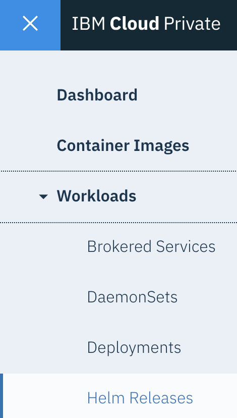

Consider the following tasks after installing {{site.data.reuse.long_name}}.

## Verifying your installation

To verify that your {{site.data.reuse.long_name}} installation deployed successfully, check the status of your release as follows.

1. {{site.data.reuse.icp_ui_login}}
2. Enter an {{site.data.reuse.icp}} administrator user name and password.
3. From the navigation menu, click **Workloads > Helm Releases**.
4. Locate your installation in the **NAME** column, and ensure the **STATUS** column for that row states **Deployed**.
5. Optional: Click the name of your installation to check further details of your {{site.data.reuse.long_name}} installation. For example, you can check the ConfigMaps used, or check the logs for your pods.
6. [Log in](../../getting-started/logging-in) to your {{site.data.reuse.long_name}} UI to get started.

## Installing the CLI

The {{site.data.reuse.long_name}} CLI is a plugin for the {{site.data.reuse.icp}} CLI. You can use the {{site.data.reuse.long_name}} CLI to manage your {{site.data.reuse.long_name}} instance from the command line, such as creating, deleting, and updating topics.

To install the {{site.data.reuse.long_name}} CLI:
1. Ensure you have the [{{site.data.reuse.icp}} CLI installed](https://www.ibm.com/support/knowledgecenter/SSBS6K_3.1.0/manage_cluster/install_cli.html).
2. [Log in](../../getting-started/logging-in/) to the {{site.data.reuse.long_name}} as an administrator.
3. Click the **Toolbox** tab.
4. Go to the **{{site.data.reuse.long_name}} command-line interface** section and click **Find out more**.
5. Download the {{site.data.reuse.long_name}} CLI plug-in for your system by using the appropriate link.
6. Install the plugin using the following command:\\
   `cloudctl plugin install <full_path>/es-plugin`

To start the {{site.data.reuse.long_name}} CLI and check all available command options in the CLI, use the `cloudctl es` command. To get help on each command use the `--help` option.

To use the {{site.data.reuse.long_name}} CLI on a deployed {{site.data.reuse.icp}} cluster, run the following three commands, replacing `<master_ip>` with your master node IP address, `<master_port>` with the master node port number (default is `8443`), and `<my_cluster>` with your cluster name:
```
cloudctl login -a https://<master_ip>:<master_port>
cloudctl cluster-config <my_cluster>
cloudctl es init
```

## Firewall settings

In your firewall settings, ensure you enable communication for the node ports that {{site.data.reuse.long_name}} services use. To find out what ports need to be opened, follow these steps:

1. {{site.data.reuse.icp_ui_login}}
2. From the navigation menu, click **Workloads > Helm Releases**.\\
   {:height="30%" width="30%"}
3. Locate the release name of your {{site.data.reuse.long_name}} installation in the **NAME** column, and click the name.
4. Scroll down to the **Service** table. The table lists information about the {{site.data.reuse.long_name}} services.
5. In the **Service** table, look for `NodePort` in the **TYPE** column.\\
   In each row that has `NodePort` as type, look in the **PORT(S)** column to find the port numbers you need to ensure are open to communication.\\
   The port numbers are paired as `<internal_number:external_number>` (for example, `32000:30553`). For your firewall settings, ensure the external numbers are open.\\
   The following image provides an example of the table:\\
   


## Connecting clients

You can [set up external client access](../configuring/#configuring-external-access) during installation. After installation, clients can connect to the Kafka cluster by using the externally visible IP address for the Kubernetes cluster. The port number for the connection is allocated automatically and varies between installations. To look up this port number after the installation is complete:

1. {{site.data.reuse.icp_ui_login}}
2. Enter an {{site.data.reuse.icp}} administrator user name and password.
3. From the navigation menu, click **Workloads > Helm Releases**.
4. In the **NAME** column, locate and click the release name used during installation.
5. Scroll down through the sections and locate the **Service** section.
6. In the **NAME** column, locate and click the **`<releasename>-ibm-es-proxy-svc`** NodePort entry.
7. In the **Type** column, locate the list of **Node port** links.
8. Locate the top entry in the list named **`bootstrap <bootstrap port>/TCP`**.
8. If no external hostname was specified when {{site.data.reuse.long_name}} was installed, this is the IP address and port number that external clients should connect to.
9. If an external hostname was specified when {{site.data.reuse.long_name}} was installed, clients should connect to that external hostname using this bootstrap port number.

Before connecting a client, ensure the necessary certificates are configured within your client environment. Use the TLS and CA certificates if you provided them during installation, or export the self-signed public certificate from the browser as follows:

1. Log in to your {{site.data.reuse.long_name}} UI.
2. Click the **Topics** tab to view the topic list.
3. Click the topic you want to connect the client to.
4. Click the **Connection information** tab.
5. Copy the broker information. This gives the bootstrap address for Kafka clients.
6. From the **Certificates** section, download the server certificate. If you are using a Java client, use the JKS truststore. Otherwise, use the PEM certificate.


## Scaling

Depending on the size of the environment that you are installing, consider scaling and sizing options. You might also need to change scale and size settings for your services over time. For example, you might need to add additional Kafka brokers over time.

See [how to scale your environment](../../administering/scaling)

## Considerations for GDPR readiness

Consider [the requirements for GDPR](../../security/gdpr-considerations/), including [encrypting your data](../../security/encrypting-data/) for protecting it from loss or unauthorized access.
