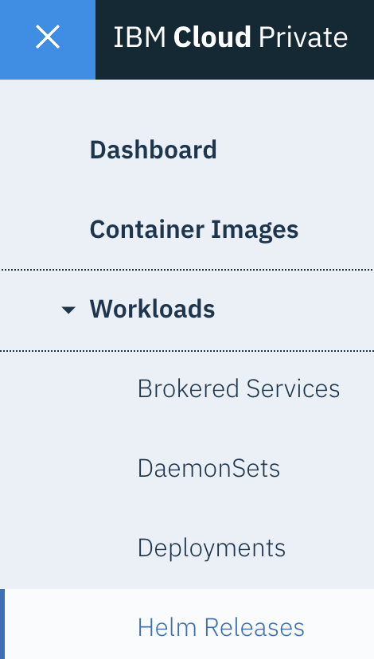
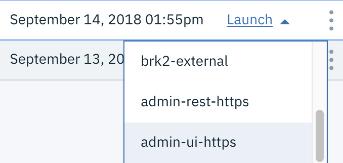

Log in to your {{site.data.reuse.long_name}} installation. To determine the {{site.data.reuse.long_name}} UI URL:

1. {{site.data.reuse.icp_ui_login}}
2. From the navigation menu, click **Workloads > Helm Releases**.\\
   {:height="30%" width="30%"}
3. Locate the release name of your {{site.data.reuse.long_name}} installation in the **NAME** column.
4. Expand the **Launch** link in the row and click **admin-ui-https**.\\
   {:height="50%" width="50%"}\\
   The {{site.data.reuse.long_name}} log in page is displayed.\\
   **Note:** You can also determine the {{site.data.reuse.long_name}} UI URL by using the CLI. Click the release name and scroll to the **Notes** section at the bottom of the page and follow the instructions. You can then use the URL to log in.
5. Use your {{site.data.reuse.icp}} administrator user name and password to access the UI. Use the same username and password as you use to log in to {{site.data.reuse.icp}}.

From the **Getting started** page, you can learn about the concepts of the underlying techcnology, explore what {{site.data.reuse.long_name}} has to offer, and even [generate starter application code](../generating-starter-app) that lets you learn more about writing applications.

You can also [test message loads](../testing-loads) to determine the best setup for your environment.
