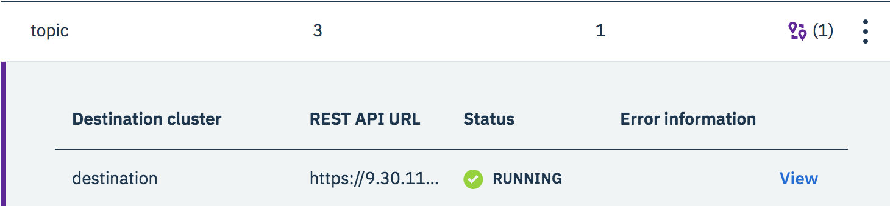

You can set up geo-replication using the {{site.data.reuse.long_name}} UI or CLI. You can then switch your applications to use another cluster when needed.

Ensure you [plan for geo-replication](../planning/) before setting it up.

## Defining destination clusters

To be able to replicate topics, you must define destination clusters. The process involves logging in to your intended destination cluster and copying its connection details to the clipboard. You then log in to the origin cluster and use the connection details to point to the intended destination cluster and define it as a possible target for your geo-replication.

### Using the UI

1. Log in to your destination {{site.data.reuse.long_name}} cluster as an administrator.
2. Click the **Topics** tab and then click **Geo-replication**.
3. Go to the **Origin locations** section, and click **Generate connection information for this cluster** under **Want to replicate topics to this cluster?**
4. Click **Copy connection information** to copy the connection details to the clipboard. This information is what you need to specify the cluster as a destination for replication when you log in to your origin cluster.\\
    **Note:** This step generates an API key for your destination cluster that is then used by your origin cluster to authenticate it.
5. Log in to your origin {{site.data.reuse.long_name}} cluster as an administrator.
6. Click the **Topics** tab and then click **Geo-replication**.
7. Click **Add destination cluster**.
8. Paste the information you copied in step 4, wait for the validation of your payload to complete and click **Add destination**.\\
    In {{site.data.reuse.long_name}} 2018.3.1 and later, click **Connect cluster**.\\
   The cluster is added as a destination to where you can replicate topics to.\\
   {{site.data.reuse.replicator_origin_list}}

 In {{site.data.reuse.long_name}} 2018.3.1 and later, you can also use the following steps:
1. Log in to your destination {{site.data.reuse.long_name}} cluster as an administrator.
2. Click **Connect to this cluster** on the right, and then go to the **Geo-replication** tab.
3. Click the **I want this cluster to be able to receive topics from another cluster** tile.
4. Click **Copy connection information** to copy the connection details to the clipboard. This information is what you need to specify the cluster as a destination for replication when you log in to your origin cluster.\\
    **Note:** This step generates an API key for your destination cluster that is then used by your origin cluster to authenticate it.
5. Log in to your origin {{site.data.reuse.long_name}} cluster as an administrator.
6. Click **Connect to this cluster** on the right, and then go to the **Geo-replication** tab.
7. Click **I want to replicate topics from this cluster to another cluster**.
8. Paste the information you copied in step 4, wait for the validation of your payload to complete and click **Connect cluster**.\\
   The cluster is added as a destination to where you can replicate topics to.\\
   {{site.data.reuse.replicator_origin_list}}

### Using the CLI

1. Go to your destination cluster. {{site.data.reuse.icp_cli_login}}
2. Run the following command to initialize the {{site.data.reuse.long_name}} CLI on the destination cluster: `cloudctl es init`
3. Run the following command to create an API key for your destination cluster:\\
   `cloudctl es geo-cluster-apikey`\\
    The command provides the API URL and the API key required for creating a destination cluster, for example:\\
   `--rest-api-url https://192.0.2.24:32046 --rest-api-key H4C2S6Moq7KuDcYRJaM4Ye_6-XShEnB6JHnATaDaBFQZ`
4. Go to your origin cluster. {{site.data.reuse.icp_cli_login}}
5. Run the following command to initialize the {{site.data.reuse.long_name}} CLI on the origin cluster: `cloudctl es init`
6. Run the following command to add the cluster as a destination to where you can replicate your topics to:\\
   `cloudctl es geo-cluster-add --rest-api-url <api-url-from-step-3> --rest-api-key <api-key-from-step-3>`

## Specifying what and where to replicate

To select the topics you want to replicate and set the destination cluster to replicate to, use the following steps.

### Using the UI

1. Log in to your origin {{site.data.reuse.long_name}} cluster as an administrator.
2. Click the **Topics** tab and then click **Geo-replication**.
3. Choose a destination cluster to replicate to by clicking the name of the cluster from the **Destination locations** list.
4. Choose the topics you want to replicate by selecting the checkbox next to each, and click **Geo-replicate to destination**.\\
   **Tip:**  In {{site.data.reuse.long_name}} 2018.3.1 and later, you can also click the  icon in the topic's row to add it to the destination cluster. The icon turns into a **Remove** button, and the topic is added to the list of topics that are geo-replicated to the destination cluster.
5. Optional: Select whether to add a prefix to the name of the new replicated topic that is created on the destination cluster. Click **Add prefix to destination topic names** to add the release name of the origin cluster as a prefix to the replicated topics.
6. Optional: Select whether you want to include the message history in the replication, or if you only want to copy the messages from the time of setting up geo-replication. Click **Include message history** if you want to include history.
7. Click **Create** to create geo-replicators for the selected topics on the chosen destination cluster. Geo-replication starts automatically when the geo-replicators for the selected topics are set up successfully.

For each topic that has geo-replication set up, a visual indicator is shown in the topic's row as follows:
* If topics are being replicated from the cluster you are logged into, the  icon is displayed in the topic's row. The number in the brackets indicates the number of destination clusters the topic is being replicated to. Clicking  expands the row to show details about the geo-replication for the topic. You can then click **View** to see more details about the geo-replicated topic in the side panel:\\
  

* If topics are being replicated to the cluster you are logged in to, the topics have the following indication that geo-replication is set up for them. Clicking the **From** `<cluster-name>` link opens the geo-replication panel with more information about the origin cluster:\\
  

### Using the CLI

To set up replication by using the CLI:

1. Go to your origin cluster. {{site.data.reuse.icp_cli_login}}
2. Run the following command to initialize the {{site.data.reuse.long_name}} CLI: `cloudctl es init`
3. Choose a destination cluster to replicate to by listing all available destination clusters, making the ID of the clusters available to select and copy: `cloudctl es geo-clusters`
4. Choose the topics you want to replicate by listing your topics, making their names available to select and copy: `cloudctl es topics`
5. Specify the destination cluster to replicate to, and set the topics you want to replicate. Use the required destination cluster ID and topic names retrieved in the previous steps. The command creates one replicator for each topic. To set up more that one geo-replicators at once, list each topic you want to replicate using a comma-separated list without spaces in between:\\
   `cloudctl es geo-replicator-create --destination <cluster-ID-from-step-3> --topics <comma-separated-list-of-topic-names-from-step-4>`\\
   Geo-replication starts automatically when the geo-replicators for the selected topics are set up successfully.
    * Optional: You can specify to add a prefix to the name of the new replicated topic that is created on the destination cluster by using the `--prefix <prefix-name>` option.
    * Optional: Select whether you want to include message history in the replication, or if you only want to copy the messages from the time of setting up geo-replication. Set one of the following:
        * Use the `--from earliest` option to include available message history in geo-replication. This means all available message data for the topic is copied.
        * Use the `--from latest` option to exclude available message history. This means that only message data from the time of setting up replication is copied.

For example, to use all options to create the geo-replicators:\\
`cloudctl es geo-replicator-create --destination <cluster-ID-from-step-3> --topics <comma-separated-list-of-topic-names-from-step-4> --from <earliest or latest> --prefix <topic-name-prefix>`\\
\\
For example:\\
`cloudctl es geo-replicator-create --destination DestinationClusterId --topics MyTopicName1,MyTopicName2 --from latest --prefix GeoReplica-`

When your geo-replication is set up, you can [monitor and manage it](../health).

## Switching clusters

When one of your origin {{site.data.reuse.long_name}} clusters experiences problems and goes down, you are notified on the destination cluster UI that the origin cluster is offline.

You can switch your applications over to use the geo-replicated topics on the destination cluster as follows.

 In {{site.data.reuse.long_name}} 2018.3.0, use the following steps:
1. Log in to your destination {{site.data.reuse.long_name}} cluster as an administrator.
2. Click the **Topics** tab, and click the name of the topic you want your application to use.
3. Click the **Connection information** tab, and use the information on the page to change your client application settings to use the geo-replicated topic on the destination cluster. You need the following information to do this:\\
   * **Connection information**: Make a note of the topic name and the Broker URL to connect an application to this topic.
   * **Certificates**: Download a certificate that is required by your Kafka clients to connect securely to this cluster.
   * **Credentials and access control**: To connect securely to {{site.data.reuse.long_name}}, your application needs an API key with permission to access the cluster and resources such as topics. Follow the link on the UI to [generate an API key](../../getting-started/client/#securing-the-connection).

 In {{site.data.reuse.long_name}} 2018.3.1 and later, use the following steps:
1. Log in to your destination {{site.data.reuse.long_name}} cluster as an administrator.
2. Click **Connect to this cluster** on the right.
3. Go to the **Connect a client** tab, and use the information on the page to change your client application settings to use the geo-replicated topic on the destination cluster. You need the following information to do this:\\
   * **Bootstrap server**: Copy the Broker URL to connect an application to this topic.
   * **Certificates**: Download a certificate that is required by your Kafka clients to connect securely to this cluster.
   * **API key**: To connect securely to {{site.data.reuse.long_name}}, your application needs an API key with permission to access the cluster and resources such as topics. Follow the instructions to generate an API key authorized to connect to the cluster, and select what level of access you want it to grant to your resources (topics). You can then select which topics you want included or to include all topics, and set consumer groups as well.

After the connection is configured, your client application can continue to operate using the geo-replicated topics on the destination cluster.

Decide whether you want your client application to continue processing messages on the destination cluster from the point they reached on the topic on the origin cluster, or if you want your client application to start processing messages from the beginning of the topic.

* To continue processing messages from the point they reached on the topic on the origin cluster, you can specify the offset for the consumer group that your client application is using:\\
  \\
  `cloudctl es group-reset --group <your-consumer-group-id> --topic <topic-name> --mode datetime --value <timestamp>`\\
  \\
  For example, the following command instructs the applications in consumer group `consumer-group-1` to start consuming messages with timestamps from after midday on 28th September 2018:\\
  \\
  `cloudctl es group-reset --group consumer-group-1 --topic GEOREPLICATED.TOPIC --mode datetime --value 2018-09-28T12:00:00+00:00 --execute`

* To start processing messages from the beginning of the topic, you can use the `--mode earliest` option, for example:\\
  `cloudctl es group-reset --group consumer-group-1 --topic GEOREPLICATED.TOPIC --mode earliest --execute`

These methods also avoid the need to make code changes to your client application.
