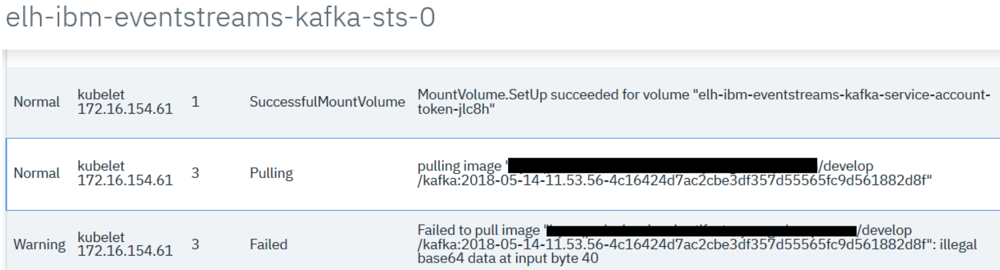

If {{site.data.reuse.long_name}} resources are not available, the following are possible sypmtoms and causes.

## {{site.data.reuse.long_name}} not available after installation

After a successsful installation message is displayed, {{site.data.reuse.long_name}} might not be available to use yet.

It can take up to 10 minutes before {{site.data.reuse.long_name}} is available to use. The {{site.data.reuse.icp}} installation might return a successful completion message before all {{site.data.reuse.short_name}} services start up.

## Insufficient system resources

You can specify the memory and CPU requirements when {{site.data.reuse.long_name}} is installed. If the values set are larger than the resources available, then pods will fail to start.

For example, each Kafka broker is set to require 80GB of memory on a system that only has 16GB available per node. In such case you might see the following error message:


To get detailed information on the cause of the error, check the events for the individual pods, and not the logs at the stateful set level.

If a system has 16GB of memory available per node, then the broker memory requirements must be set to be less than 16GB. This allows resources to be available for the other {{site.data.reuse.long_name}} components which may reside on the same node.

To correct this issue, uninstall {{site.data.reuse.long_name}}. Install again using lower resource requirements, or increase the amount of system resources available to the pod.

## Problems with secrets

When using a non-default Docker registry, you might need to provide a secret which stores the user ID and password to access that registry.

If there are issues with the secret that holds the user ID and password used to access the Docker registry, the events for a pod will show an error similar to the following.



To resolve this issue correct the secret and install {{site.data.reuse.long_name}} again.

## Installation failure stating object already exists

If a secret that does not exist is specified during installation, the process fails even if no secret is required to access the docker registry.

The default docker image registry at `ibmcom` does not require a secret specifying the user ID and password.

To correct this, install {{site.data.reuse.long_name}} again without specifying a secret.

If you are using a Docker image registry that does require a secret, attempting to install again might fail stating that an object already exists, for example:

```
Internal service error : rpc error: code = Unknown desc = rolebindings.rbac.authorization.k8s.io "elh-ibm-es-secret-copy-crb-sys" already exists
```

Delete the left over object cited and other objects before trying to install again. For instructions, see [how to fully clean up](../cleanup-uninstall/) after uninstallation.
