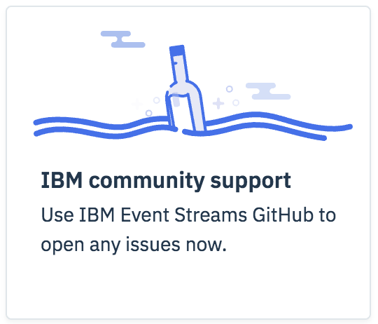
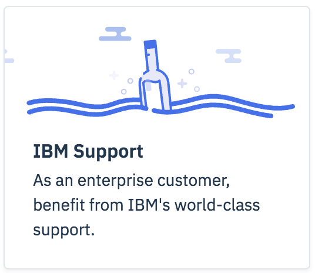
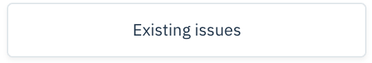
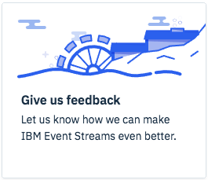

This is your opportunity to let us know what you think about {{site.data.reuse.long_name}}.

## Open an issue

[{:height="50%" width="50%"}](https://github.com/IBM/event-streams/issues?q=label%3Abug){:target="_blank"}\\
*Please do not share confidential information on public GitHub.*

## Suggest a feature
We would love to hear what you would like to see in future versions of IBM Event Streams.\\
[{:height="50%" width="50%"}](https://github.com/IBM/event-streams/issues/new?template=feature_request.md&labels=featureRequest){:target="_blank"}\\
[{:height="50%" width="50%"}](https://github.com/IBM/event-streams/issues?q=label%3AfeatureRequest){:target="_blank"}\\
*Please do not share confidential information.*
## Give us feedback
We’d love to know how we’re doing and how IBM Event Streams is helping you to solve problems in your business.\\
[{:height="50%" width="50%"}](mailto:eventstreams@uk.ibm.com?Subject=Feedback%20for%20IBM%20Event%20Streams)\\
[{:height="50%" width="50%"}](https://slack-invite-ibm-cloud-tech.mybluemix.net/){:target="_blank"}
